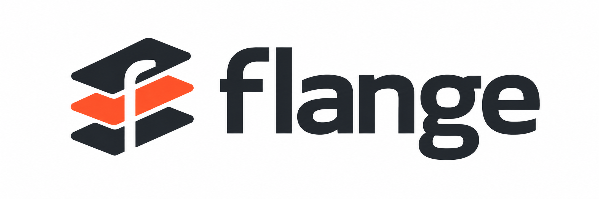
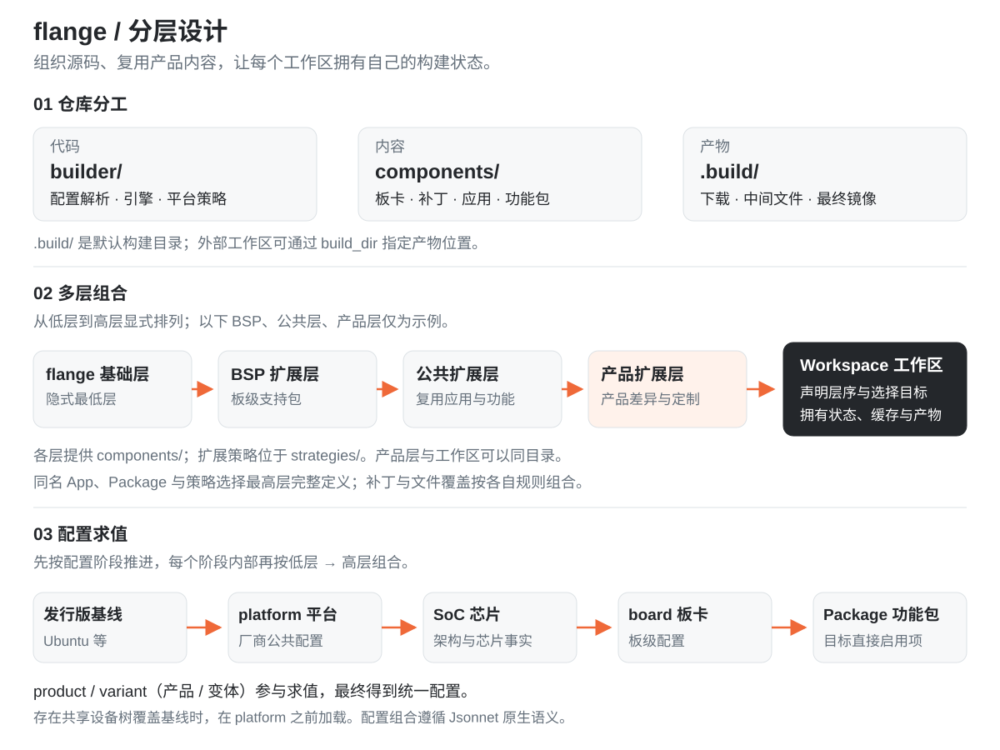
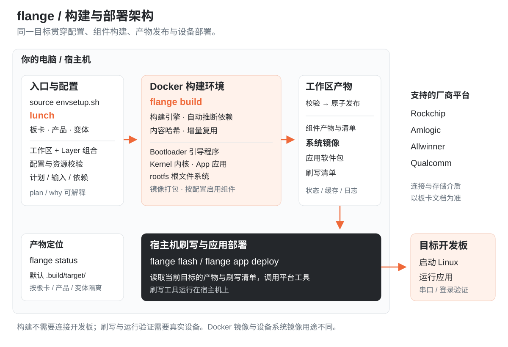

<p align="center">
  
</p>

<h1 align="center">从源码，到开发板上的 Linux。</h1>
<p align="center">构建系统镜像 · 增量更新组件 · 开发板上应用</p>
<p align="center">
  <a href="#支持的开发板">支持的开发板</a> ·
  <a href="#快速开始">快速开始</a> ·
  <a href="docs/README.md">开发文档</a> ·
  <a href="CONTRIBUTING.md">参与贡献</a>
</p>

**flange 是基于 ubuntu-base（Ubuntu 最小基础文件系统）的嵌入式 Linux 构建框架。**
在电脑上选择板卡与产品配置，由 Docker 编译、打包，再由宿主机将系统镜像刷入开发板。
既可以构建整套系统，也可以只更新内核，或独立开发板上运行的 App（应用）。

## 支持的开发板

**19 块板卡配置 · 4 个厂商平台**，按仓库内置配置核对于 2026-09-06。
点击板名查看存储介质、接线、刷写方式和功能记录。

> **支持范围**：下表表示仓库已有对应板卡配置，不代表当前版本的所有外设都已完成实机验收。
> 具体可用功能以各板卡页标明的目标、版本和验证记录为准。

### Rockchip · 12 块

| 开发板 | SoC（片上系统） | 配置标识 |
| --- | --- | --- |
| [正点原子 RK3506B](wiki/boards/atk-rk3506b.md) | RK3506B · ARM32 | `atk-rk3506b` |
| [Radxa ZERO 3W](wiki/boards/radxa-zero3w.md) | RK3566 | `radxa-zero3w` |
| [泰山派](wiki/boards/tspi-rk3566.md) | RK3566 | `tspi-rk3566` |
| [Neons Core3566 + NanoB](wiki/boards/neons-core3566-nanob.md) | RK3566 | `neons-core3566-nanob` |
| [Orange Pi CM4](wiki/boards/orangepi-cm4.md) | RK3566 | `orangepi-cm4` |
| [RP Pro RK3568 H](wiki/boards/rp-pro-rk3568-h.md) | RK3568 | `rp-pro-rk3568-h` |
| [ArmSoM CM5 + IO](wiki/boards/armsom-cm5-io.md) | RK3576 | `armsom-cm5-io` |
| [Radxa ROCK 4D](wiki/boards/radxa-rock-4d.md) | RK3576 | `radxa-rock-4d` |
| [Radxa ROCK 5B](wiki/boards/radxa-rock5b.md) | RK3588 | `radxa-rock5b` |
| [Orange Pi 5 Plus](wiki/boards/orangepi-5-plus.md) | RK3588 | `orangepi-5-plus` |
| [Radxa ROCK 5C Lite](wiki/boards/radxa-rock5c-lite.md) | RK3582 | `radxa-rock5c-lite` |
| [Orange Pi CM5 Tablet](wiki/boards/orangepi-cm5-tablet.md) | RK3588S | `orangepi-cm5-tablet` |

### Amlogic · 3 块

| 开发板 | SoC | 配置标识 |
| --- | --- | --- |
| [Khadas VIM3](wiki/boards/khadas-vim3.md) | A311D | `khadas-vim3` |
| [Khadas VIM3L](wiki/boards/khadas-vim3l.md) | S905D3 | `khadas-vim3l` |
| [Radxa ZERO](wiki/boards/radxa-zero.md) | S905Y2 | `radxa-zero` |

VIM3 已验证 U-Boot 进入 fastboot，完整系统启动与外设待验收；Radxa ZERO 配置已就绪，实板验收待完成。

### Allwinner · 2 块

| 开发板 | SoC | 配置标识 |
| --- | --- | --- |
| [Radxa Cubie A7A](wiki/boards/radxa-cubie-a7a.md) | A733 | `radxa-cubie-a7a` |
| [Radxa Cubie A7Z](wiki/boards/radxa-cubie-a7z.md) | A733 | `radxa-cubie-a7z` |

### Qualcomm · 2 块

| 开发板 | SoC | 配置标识 |
| --- | --- | --- |
| [Radxa Dragon Q6A](wiki/boards/radxa-dragon-q6a.md) | QCS6490 | `radxa-dragon-q6a` |
| [Radxa Dragon Q8B](wiki/boards/radxa-dragon-q8b.md) | SC8280XP | `radxa-dragon-q8b` |

找到板卡后，用 `flange target list <配置标识>` 查看可选产品与变体。
[全部板卡记录](wiki/boards/index.md) · [新增板级支持](docs/extension-guide.md)

## 快速开始

**准备环境 → 选择目标 → 构建镜像 → 刷写开发板。**

需要 Linux 或 macOS、Git、Python **3.12+**（含 venv / pip）、Bash 或 Zsh，
以及已启动的 Docker 和 Compose v2。首次使用请先查看[构建环境准备](docs/first-steps.md#第二步在-docker-中编译第一个-app)；
内核源码与工作树需要大小写敏感文件系统，macOS 默认 APFS 通常不满足。

在终端依次执行：

```bash
git clone https://github.com/flange-build/flange.git
cd flange

# 1. 初始化命令环境
source envsetup.sh

# 2. 打开菜单，选择自己的板卡、产品与变体
lunch

# 3. 构建完整系统镜像（首次构建前先执行一次 flange docker build）
flange build

# 4. 构建成功后，按板卡文档连接设备并进入刷写模式
flange flash
```

- **选择目标**：`lunch` 保存当前目标，后续构建与刷写使用同一配置。也可直接指定，
  例如 `lunch radxa-zero3w-default-debug`，表示 Radxa ZERO 3W、`default` 产品、`debug` 调试变体。
- **构建镜像**：`flange build` 在 Docker 中编译所需组件并打包系统镜像；用 `flange status` 查看产物位置。
  首次需用 `flange docker build` 准备构建环境，初始化时 Jsonnet 缺少预编译包还需要宿主 C++ 编译工具。
- **刷写设备**：按[对应板卡说明](wiki/boards/index.md)准备 USB 连接或目标存储介质。
  `flange flash` 在宿主机执行全量刷写，会重写目标分区与已有数据，请提前备份。
  刷写成功后，按板卡说明重启并检查串口或登录状态。

**还没有开发板？** 在 `lunch` 后运行 `flange plan image`，即可查看构建计划；不会编译或写入设备。
完整操作与排障见[开发指南](docs/development-guide.md)。

## 选择你的学习路径

| 你现在想做什么 | 阅读顺序 |
| --- | --- |
| 我刚接触开发板，先跑通工具 | [第一次使用](docs/first-steps.md) → [开发指南](docs/development-guide.md) |
| 我想构建系统、刷写自己的板卡 | [第一次构建系统镜像](docs/first-steps.md#第三步为自己的开发板构建系统镜像) → [板卡索引](wiki/boards/index.md) → [刷写与验证](docs/development-guide.md#4-刷写与设备验证) |
| 我只想开发板上运行的程序 | [第一个 App](docs/first-steps.md#第二步在-docker-中编译第一个-app) → [App 开发与部署](docs/development-guide.md#5-在仓库外创建和构建-app) |
| 我已有 CPack 工程，要分开交付运行包和开发 SDK | [多 DEB 与包格式后端](docs/package-backends.md) |
| 我接手已有项目，需要更新、排障和验证 | [维护指南](docs/maintenance-guide.md) → [架构职责参考](docs/build-system-design.md) |
| 我想加软件、驱动、板卡或平台 | [扩展指南](docs/extension-guide.md) → [项目规格](ProjectSpec.md) |

查 Recovery（维护系统）、AMP（非对称多处理）和其他专题，请使用[完整文档导航](docs/README.md)。
“配置中有这块板”与“全部功能已完成实机验证”是不同状态，板卡记录给出具体范围。

## 分层与架构设计

| 系统构建 | 组件迭代 | 应用开发 |
| --- | --- | --- |
| 组合 Bootloader（引导程序）、Kernel（内核）与 rootfs（根文件系统） | 根据内容哈希判断变更，复用未变化组件的产物 | 在独立工作区创建、构建、部署和调试 App |
| [构建第一个系统镜像](docs/first-steps.md#第三步为自己的开发板构建系统镜像) | [了解增量构建](docs/development-guide.md) | [开发第一个 App](docs/first-steps.md#第二步在-docker-中编译第一个-app) |

### 分层设计

仓库按 **代码、内容、产物** 分工；多个 Layer（扩展层）提供可复用的配置、内容和策略，
由 Workspace（工作区）显式组合。配置按发行版、平台、SoC、板卡和功能包逐阶段求值，每阶段内部再按层序组合。

[](docs/assets/architecture/flange-layers.svg)

扩展层的声明、优先级与覆盖规则见[多层工作区指南](docs/layers.md)，目录约定见[项目规格](ProjectSpec.md#9-目录结构约定)。

### 构建与部署架构

宿主机选择目标并解析配置，Docker 负责组件编译和镜像制作；校验后的产物发布到工作区，
再由宿主机读取清单，将系统刷写或应用部署到开发板。

[](docs/assets/architecture/flange-architecture.svg)

**Docker 镜像**提供构建环境，**设备系统镜像**用于写入开发板。
构建不需要连接设备；刷写与运行验证需要真实设备。用 `flange status` 查看产物位置，用 `flange why` 查看重建原因。

模块职责与产物契约见[架构设计](docs/build-system-design.md)。Docker 统一工具环境，
跨时间复现还需要固定源码、工具链和软件包输入，详见[设计评审](docs/build-system-review.md)。

## 参与贡献与反馈

先阅读[贡献指南](CONTRIBUTING.md)和[项目规格](ProjectSpec.md)。
反馈问题请附完整目标名、宿主环境、复现命令与脱敏日志：
[GitHub Issues](https://github.com/flange-build/flange/issues)。

flange 自有代码与文档采用 [Apache License 2.0](LICENSE)。
第三方源码、固件、工具、补丁及生成镜像中的软件包保留各自许可，详见[许可说明](docs/licensing.md)。
