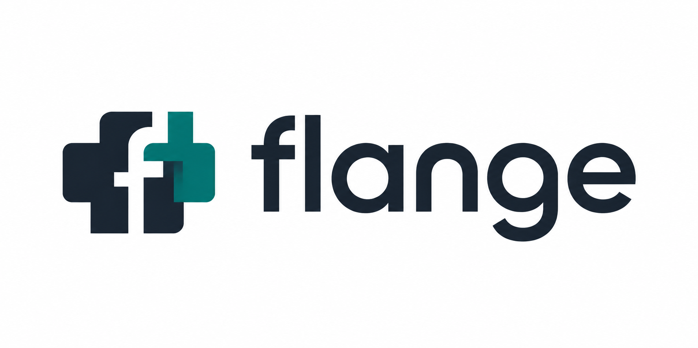

<p align="center">
  
</p>

<h1 align="center">flange</h1>
<p align="center">为开发板构建 Linux 系统，也为运行在板上的应用提供开发工具。</p>
<p align="center">
  <a href="docs/first-steps.md">第一次使用</a> ·
  <a href="docs/README.md">文档导航</a> ·
  <a href="wiki/boards/index.md">查找开发板</a> ·
  <a href="CONTRIBUTING.md">参与贡献</a>
</p>

**flange 是运行在你电脑上的嵌入式 Linux 构建工具。**
它根据开发板配置，准备 Bootloader（引导程序）、Kernel（内核）和 rootfs（根文件系统），
组合成可以写入开发板存储的系统镜像。rootfs 基于 ubuntu-base（Ubuntu 的最小基础文件系统），
可复用 Ubuntu 软件包。

你可以用它构建整套系统、只更新内核等组件，或独立开发板上运行的 App（应用）。
已有板卡配置覆盖 Rockchip、Amlogic、Allwinner 和 Qualcomm；
具体板型、存储介质和已验证功能请查[板卡索引](wiki/boards/index.md)。

## 它如何连接电脑与开发板


**Docker 镜像**提供电脑上的构建环境；**设备系统镜像**才是要写入开发板的内容。
构建不需要连接开发板，刷写和运行验证才需要真实设备。

## 快速开始

先完成一次**查看配置与构建计划**：不需要开发板，也不需要先下载内核或准备 Docker。
你需要 Linux 或 macOS、Git、Python **3.12+**（含 venv / pip），以及 Bash 或 Zsh。
Jsonnet 依赖没有适配的预编译包时，安装阶段还需要宿主 C++ 编译工具。

```bash
git clone https://github.com/flange-build/flange.git
cd flange
source envsetup.sh

# 示例目标只用于学习；实际构建、部署要选择自己的板卡
flange target list radxa-zero3w
flange target select radxa-zero3w-default-debug
flange target show
flange plan image
flange status
```

看到目标名 `radxa-zero3w-default-debug`、组件计划，以及末尾“计划未执行构建”的提示，就完成了第一步。
`status` 显示未来产物的存放位置；此时还没有生成系统镜像。

目标名表示 **board（板卡）- product（产品配置）- variant（构建变体）**。
这里选的是 Radxa Zero 3W、`default` 产品、`debug` 调试变体；
`lunch <目标名>` 是 `flange target select <目标名>` 的快捷写法。

接下来阅读 **[第一次使用：从计划到第一个 App，再到系统镜像](docs/first-steps.md)**。
其中说明 Linux / macOS 的构建前提、每一步的成功判断，以及有板和无板时各自的下一步。
实际编译需要 Docker；内核源码与工作树还需要大小写敏感文件系统，macOS 默认 APFS 通常不满足。

## 选择你的学习路径

| 你现在想做什么 | 阅读顺序 |
| --- | --- |
| 我刚接触开发板，先跑通工具 | [第一次使用](docs/first-steps.md) → [开发指南](docs/development-guide.md) |
| 我想构建系统、刷写自己的板卡 | [第一次构建系统镜像](docs/first-steps.md#第三步为自己的开发板构建系统镜像) → [板卡索引](wiki/boards/index.md) → [刷写与验证](docs/development-guide.md#4-刷写与设备验证) |
| 我只想开发板上运行的程序 | [第一个 App](docs/first-steps.md#第二步在-docker-中编译第一个-app) → [App 开发与部署](docs/development-guide.md#5-在仓库外创建和构建-app) |
| 我已有 CPack 工程，要分开交付运行包和开发 SDK | [多 DEB 与包格式后端](docs/package-backends.md) |
| 我接手已有项目，需要更新、排障和验证 | [维护指南](docs/maintenance-guide.md) → [架构职责参考](docs/build-system-design.md) |
| 我想加软件、驱动、板卡或平台 | [扩展指南](docs/extension-guide.md) → [项目规格](ProjectSpec.md) |

查 Recovery（维护系统）、AMP（非对称多处理）和其他专题，请使用[完整文档导航](docs/README.md)。
“配置中有这块板”与“全部功能已完成实机验证”是不同状态，板卡记录给出具体范围。

## 项目放在哪里

```text
flange/
├── builder/       # 工具代码：解析配置、构建、缓存、部署
├── components/    # 系统内容：板卡配置、补丁、应用、功能包
├── .build/        # 下载、中间文件与产物（默认位置，不提交）
├── docs/          # 入门、操作、维护与扩展指南
├── wiki/          # 板卡与外设的具体经验
└── ProjectSpec.md # 项目约束与编码规范
```

第一次可以直接在此仓库操作；开发自己的 App 时，用 `flange init` 建立独立工作区。
增量构建会按内容变化判断需要重建的组件，`flange why` 可解释原因。
Docker 统一工具环境；跨时间复现仍需固定源码、工具链和软件包输入，详见[设计评审](docs/build-system-review.md)。

## 参与贡献与反馈

先阅读[贡献指南](CONTRIBUTING.md)和[项目规格](ProjectSpec.md)。
反馈问题请附完整目标名、宿主环境、复现命令与脱敏日志：
[GitHub Issues](https://github.com/flange-build/flange/issues)。

flange 自有代码与文档采用 [Apache License 2.0](LICENSE)。
第三方源码、固件、工具、补丁及生成镜像中的软件包保留各自许可，详见[许可说明](docs/licensing.md)。
