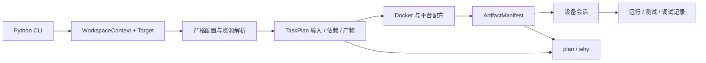

# flange 构建系统设计与维护指南

本文描述当前代码边界及修改落点。操作步骤见[开发指南](development-guide.md)，规范见
[ProjectSpec](../ProjectSpec.md)，重构前问题、处置和验证证据见[设计评审](build-system-review.md)。

第一次阅读源码，可先沿[维护指南的一条命令](maintenance-guide.md#2-跟着一条命令读代码)走一遍；
已经明确要添加功能时，按[扩展指南](extension-guide.md)选择修改层。本页用于查阅内部契约。

工作区的 `LayerStack` 是内容、配置和策略解析的共同入口。`layers.py` 管理声明、依赖、资源身份与隔离模块，
`layer_resources.py` 管理补丁和 overlay 顺序，`distro.py`、`build_environment.py`、`toolchain.py` 提供
发行版、完整容器和独立 SDK 接口。扩展层格式及缓存边界见[多层工作区](layers.md)。

## 1. 设计原则与边界

构建工具应把一组声明输入转换为可验证产物，再让部署和验证消费同一产物身份。
工作目录、文件碰巧存在、CLI 字符串和缓存成功标记不能替代这些事实。



- 宿主负责命令呈现、配置、容器编排、USB 刷写及 ADB 设备会话。
- Docker 负责目标编译、rootfs/chroot 和镜像制作。
- 工作区保存自己的目标、外部 App 注册和产物路径；工具 checkout 提供代码、模板与平台内容。
- 平台策略保留硬件配方，通用层承担输入、执行、依赖、缓存和产物契约。

这是一套本地开发与交付链。分布式构建、OTA/A/B 服务、完整符号仓库与设备实验室不在当前实现范围。

## 2. 工作区与路径归属

`builder/workspace.py` 的 frozen dataclass（不可变数据类）是入口间共享的上下文：

| 值 | 责任 |
| --- | --- |
| `Target(board, product, variant)` | 结构化目标；`key` 为可显示目标字符串 |
| `tool_root` | flange 代码、`components/`、模板、Docker 配置 |
| `workspace_root` | `flange.toml` 与当前项目身份 |
| `build_root` | 可删除的下载缓存、中间目录、已发布产物 |
| `invocation_dir` | 只解释用户相对路径，不构成 target 身份 |
| `apps` / `app_dirs` | 声明位置解析后的外部 App 注册与搜索根 |
| `state_file` | 当前工作区 `.flange/current_config` |

工作区发现向父目录查找 `flange.toml`；工具根可以成为无清单工作区。
选择优先级为本次 `--target` → 工作区保存状态 → 清单 `[target]`。
工具配置仍通过 `registry.resolve_config(..., project_root=tool_root)` 求值，AppResolver 同时消费工作区注册。
不要重新把 tool_root、调用目录和输出目录压回一个 `project_root`。

```text
<tool_root>/builder/                         # 框架代码
<tool_root>/components/                      # 平台与产品内容
<workspace_root>/flange.toml                 # 项目声明
<workspace_root>/.flange/current_config      # 当前目标
<build_root>/sources/                        # 下载/源码存储
<build_root>/work/<target.key>/              # 可变构建工作目录
<build_root>/target/<board>/<product>/<variant>/  # 已发布产物
<build_root>/cache/rootfs-base/              # 共享基础快照
<build_root>/locks/                          # 目标、源码等并发锁
```

通用目录常量由 `builder/paths.py` 定义，实际工作区路径由 context 派生。
不依赖根目录 `target` 链接，不能把一个 checkout 的 `.build` 硬编码进外部开发流程。

## 3. 模块职责与抽象

| 模块 | 责任与适用修改 |
| --- | --- |
| `cli.py`、`commands.py`、`presentation.py` | 命令语法、退出码、人类/JSON 输出；不承载平台配方 |
| `workspace.py` | 清单、目标选择、路径域与上下文构建 |
| `config/jsonnet.py` | 四层求值、包配置、归一化和依赖元数据 |
| `config/schema.py`、`validate.py` | 闭合结构规则与跨字段/平台语义 |
| `config/registry.py`、`query.py` | 平台/板卡发现、统一 target 解析和枚举 |
| `graph.py`、`component_plan.py` | 输入、依赖、启用状态、产物与系统计划 |
| `digest.py`、`artifacts.py` | 内容树身份和成功产物清单 |
| `engine.py`、`cache.py` | 拓扑执行、成功记录、重建解释 |
| `locking.py`、`source.py` | 锁、原子写入、源码准备与工作树隔离 |
| `docker.py`、`oot_mounts.py` | 容器执行与工作区/外部目录挂载 |
| `base.py`、`platforms/*` | configure/compile/collect 模板方法与平台策略 |
| `rootfs_base.py`、`rootfs.py`、`recovery.py` | 基础阶段计划、系统个性化和维护系统 |
| `rootfs_storage.py`、`chroot.py` | 原生临时活树、临时文件恢复、挂载回滚与安全清理 |
| `image.py`、`partition/*`、`flash/generate.py` | 镜像装配、几何计算与刷写清单 |
| `app_spec.py`、`packages.py` | App 与 Package 的输入边界 |
| `package_build.py` | Package 显式 build action 的隔离执行、产物与报告 |
| `filesystem.py` | 在准备源码和内核配置前拒绝大小写不敏感工作目录 |
| `app_resolver.py`、`app_build.py`、`toolchain.py` | App 闭包、原生构建适配和准确产物发布 |
| `app_model.py`、`packaging/` | 包格式与角色记录、AppBuildReport、格式后端；DEB 实现复用 deb.py |
| `build_dependencies.py` | Ubuntu 构建容器的 APT 编译依赖，与交付格式独立 |
| `apt.py` | 实际 APT 缓存目录、显式命令参数和跨工作区互斥 |
| `dev.py`、`deploy.py` | 资源生命周期、设备传输与测试/调试会话 |
| `flash/execute.py`、`flash/strategy.py`、`recovery_host.py` | 宿主刷写、设备能力与在线恢复 |

数据类表示目标、计划、资源和产物等值对象；Protocol（协议）用于设备等需要替换的边界；
平台策略承载硬件差异；上下文管理器管理锁和临时资源。
新增抽象必须有明确消费者，不为相似的函数名预先建立通用插件框架。

## 4. 从配置到计划

### 4.1 系统配置求值

固定基础顺序为 `rootfs → platform → SoC → board`。
存在共享 `device-tree-overlay/config.jsonnet` 时，在平台层之前加入该共享基线。
board 首次求值选择 `packages`，按选择顺序追加包内 `config.jsonnet`，不递归追加新的包。
product/variant 通过 Jsonnet 外部变量求值，最终没有待执行的维度子树。

求值分为三个明确边界：

1. 检查 board 身份、维度及受限 import；读取依赖文件。
2. 检查作者输入的闭合字段和严格类型，再展开 package_sets、Package 与 App 来源。
3. 校验派生输出与平台语义，返回携带依赖/hash 元数据的 `ResolvedConfig`。

普通 dict 与 ResolvedConfig 经过同一 `validate_config`；后者身份只用于携带元数据。
输入中的 `packages_meta`、`boot.package_overlay_sources` 被拒绝，因为它们属于解析器派生结果。

### 4.2 四种描述边界

| 输入 | 解析器 | 主要规则 |
| --- | --- | --- |
| `flange.toml` | `workspace.py` | 版本、根路径、App 注册、默认目标；路径相对清单 |
| 系统 Jsonnet 结果 | `config/schema.py` + `validate.py` | 闭合对象、严格 bool/int/str/list、引用/分区/平台语义 |
| `app.yaml` | `app_spec.py` | 拒绝重复 YAML 键、未知字段和隐式转换；转换为 AppSpec |
| `package.py:PACKAGE` | `packages.py` | 按 component.type 的闭合联合、包内路径与安全 argv |

系统 schema 区分 Object（固定字段对象）与 Map（动态名称映射），不会把名为 `product` 的 source 错当维度。
Package Python 文件仍是受信任的可执行代码；严格验证返回对象不等于把执行过程沙箱化。
新字段必须说明所属层、类型、默认值、合法组合、消费者和缓存输入；没有消费者就不接受该字段。

### 4.3 事实与策略

SoC 层声明架构、工具链和芯片事实；具体显示、存储、rootfs 包策略和 AMP 启用由 board/product 决定。
现有求值器审计部分层间越权。平台能力由 `platforms/spec.py` 注册，不能根据名称前缀猜能力。
新增平台后必须核对计划、收集、镜像、刷写和验证边界，单独新增目录不代表全生命周期已支持。

## 5. 执行、缓存和产物

系统入口建立 WorkspaceContext 和有效配置，构造 BuildEngine；宿主构建进入统一 Docker 环境后执行。
引擎展开所需组件依赖，准备源码，计算计划指纹；只有输入与必需产物同时有效才复用缓存。
任务完成后重新检查输入，验证全部产物，再原子发布清单。

`InputSpec` 区分值与文件树；树摘要包含节点类型、模式位、符号链接目标和文件内容，不使用 mtime 作为身份。
源码中名为 `build` 的目录不是全局排除条件；排除仅用于 VCS 元数据及明确的派生目录。
下游消费上游实际 ArtifactManifest.identity；输入变化但上游结果未变化时，不必传播无关重建。

`plan` 与 `why` 共用计划声明；预览不执行网络同步。远端 branch 当前内容无法只靠本地状态得知，
实际 build 才确认可执行输入。旧 `.build_hash` 不被迁移为有效成功记录。

目标锁保护 `.build/work/<target.key>` 与该目标发布区；共享源码存储另有锁。

APT 互斥按实际目录确定：App 共用工具仓库 `.build/cache/apt` 和 `apt-lists`，
rootfs/recovery 对实际挂载的下载目录加锁，模板下载读取共享索引时也须协调。
`AptCache` 将目录规范化、去重并排序，在目录旁创建 `.<目录名>.flange.lock`，
不把锁放入 APT clean 的清理范围，不删除 APT 自己的锁。加锁顺序为外层目标/资源锁 → APT 资源锁；
完成 APT 事务和卸载后释放，不延伸到编译过程。改变缓存挂载时必须同时更新目录描述。
本地源复制到隔离工作目录，原始用户源码不作为编译输出位置。
内核要求大小写敏感的 build_root 与实际源码工作树；不满足时诊断 `flange.toml.build_dir`，
不能通过修改目标 Kconfig 或关闭驱动弥补宿主文件系统限制。
失败不能把未完成快照或不完整产物标记为成功；旧已发布结果是否可用仍由清单验证决定。

### 5.1 rootfs、Recovery 与镜像

rootfs-base 计划集中声明 ubuntu-base URL/SHA256、APT 列表、额外源、推荐包策略、ABI、模拟器、环境与配方。
rootfs/recovery 实际基础阶段消费该计划，快照位于 `<build_root>/cache/rootfs-base/`。
保存使用临时 tar、完整验证和原子替换；损坏快照不能命中。
原始 ubuntu-base 解包与快照创建/恢复统一使用数字所有权、xattrs 和 ACL 选项，包括 `security.capability`。
`snapshot.py` 进入 Phase 1 配方指纹，不能让旧归档语义遗漏的权限属性随缓存命中进入新镜像。

可变根文件树通过 `rootfs_storage.rootfs_staging` 建立在容器原生 `/var/tmp`，不跟随 TMPDIR。
解包、快照恢复、APT、系统定制和平台成像钩子均消费这棵活树；最终镜像、包清单与辅助产物仍写入组件持久化工作目录。
存储模块进入 Phase 1 配方指纹，随机临时路径不进入缓存身份。这个边界避免宿主共享目录的权限/UID 语义影响目标系统。

ChrootContext 保存并恢复临时 DNS 和 policy-rc.d，部分初始化失败也回滚，清理始终尝试逆序卸载本次挂载。
活树删除前读取 mountinfo；仍有挂载时拒绝递归删除。主操作异常保留自身的命令诊断，清理问题作为附加说明，
避免一次包安装错误最终只剩无关 umount 输出。

基础树之后再安装各自 App 闭包、modules、固件、overlay 与账户设置，最后路由 ext4/UBI 镜像。
rootfs 和 recovery 不再扫描目录里碰巧留下的全部 deb；使用 AppBuildReport 的选择集合。
kernel 所声明的 modules 是必需产物，缺失不能在 rootfs 中静默跳过。
镜像与刷写清单依据本次启用组件过滤，旧 recovery 文件的存在不是启用指令。

### 5.2 App 的闭包与发布

AppResolver 按显式路径、工作区注册/搜索根和工具来源解析资源，统一检查缺失、歧义与循环。
所有 App 请求进入同一闭包构建器，不能在 CLI 中另写单 App 编译路径。

Toolchain 提供目标 CC/CXX/AR/STRIP；CMake/Meson 使用独立 build，Make/custom 使用隔离源副本。
依赖安装树合成编译前缀，custom 通过 `FLANGE_DEPENDENCY_DIRS` 获取准确上游目录。
打包前确认架构、运行入口和安装结果，发布 install 树、角色化软件包、resource 信息与 manifest。
完整 CPack 包先由格式后端校验和提取，再形成依赖安装树；运行与开发包都可供下游编译，
默认部署仅消费运行包。接口及扩展方式见[包格式后端](package-backends.md)。
系统安装和设备部署均消费 AppBuildReport，不按文件名或目录扫描猜当前结果。

具体字段、查找优先级和 custom 环境变量见 [App 架构](app-architecture.md)。

## 6. 设备与验证边界

`flash-config.json` 是系统产物到宿主刷写的边界；flashers 负责工具和协议，分区布局来自统一解析器。
Recovery 通过独立宿主控制面和设备 `recoveryctl` 工作，不把镜像制作嵌入传输实现。

App 部署消费已验证报告，核对设备架构并比较传输后 SHA256。
DeviceSession 保存 target、serial、产物身份、运行结果和调试配置；test 保存输出与退出状态。
GDB 支持设备端与 `adb forward` 远程模式，符号树与源码映射属于会话的一部分。
应用安装前缀不是完整系统 sysroot，系统库符号和 IDE 集成仍需额外准备。

硬件安全和功能正确性最终要靠对应板卡验收；软件测试记录不得外推为所有板卡都已通过。

## 7. 修改落点与验收

| 变更 | 同步修改和检查 |
| --- | --- |
| 增加配置字段 | schema、语义、真实消费者、计划输入、错误用例与真实 target 矩阵 |
| 新增 App 构建系统 | AppSpec 合法组合、Toolchain/执行策略、安装与 ELF 验证、实际容器产物 |
| 调整缓存范围 | InputSpec、ArtifactSpec、why；覆盖输入更改、损坏产物和失败发布 |
| 新板/新平台 | 内容配置、能力与策略、分区/刷写路由、板卡使用与验收文档 |
| 新设备动作 | argv/设备协议、会话结果、失败退出码、清理路径与模拟/实机验证 |
| 新 CLI 命令 | 参数层、独立服务、人类与 JSON 结果、非交互和错误帮助 |

局部测试通过后进行集成；真实编译在 Docker 中完成。完整运行结果见评审中的验证记录。

## 8. 文档事实源

README 提供起点；first-steps 提供首次教学；development-guide 提供操作参考；
maintenance-guide 和 extension-guide 提供修改路径；本文提供内部边界；
ProjectSpec 规定项目约束，`openspec/specs/` 记录能力契约。
历史评审和 `docs/superpowers/` 只能解释当时的决策，不能覆盖当前 CLI 或 schema。
每次改变入口、路径、字段或输出，必须一起修改当前文档、测试与对应能力规格。
