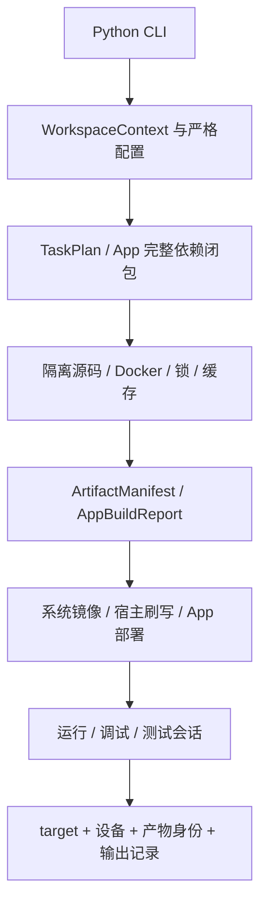

# flange 构建系统设计评审

评审与重构日期：2026-09-05。最初审查基线为 `4f21e99e9` 及当时工作区的 output、overlays、source 改动。
随后按 OpenSpec `redesign-build-lifecycle` 实施破坏性重构。
本文保留基线问题的取证过程，并单独记录当前修复状态；**第 3 节行号只对应旧基线，不能用于定位重构后的代码。**
当前接口请读[开发指南](development-guide.md)、[架构指南](build-system-design.md)和 [ProjectSpec](../ProjectSpec.md)。

## 当前整改状态

核心边界已实施：独立 WorkspaceContext、Python CLI、统一 TaskPlan、内容与元数据摘要、准确产物清单、
目标隔离、App 完整依赖闭包、严格配置、设备测试和调试会话。各项自动化与真实编译验证应分别记录；
“代码已实施”不代表所有硬件生命周期已完成实机验收。

| 基线问题 | 当前实现与证据入口 | 验证边界 |
| --- | --- | --- |
| F01 / F03 工具链与架构 | `toolchain.py`、Make 模板、`app_build.py` 的架构选择与 ELF 检查 | 模板/编排测试；真实容器矩阵另记 |
| F02 / F15 App 闭包与身份 | `app_resolver.py`、`app_model.py`，名称/path/cwd 统一身份，递归构建与精确报告 | 缺失/循环/歧义、依赖闭包与 manifest 测试 |
| F04 元数据摘要 | `digest.py` 记录类型、权限、链接和内容 | 权限/链接变更失效，mtime 不失效 |
| F05 Phase 1 双重定义 | `rootfs_base.py` 的输入计划同时驱动快照与执行 | APT、推荐包、源、模拟器、环境变更；Phase 2 不扰动 base |
| F06 必需 modules | ArtifactSpec 与 rootfs 缺失检查 | 缺树拒绝成功；允许明确的空模块树 |
| F07 残留 recovery | 公共 GPT image 按 enabled 过滤，并拒绝缺失的启用产物 | 四平台带残留文件的禁用测试 |
| F08 / F13 CI 契约 | 固定 `@fission-ai/openspec@1.2.0`，调用正式 target 解析器 | CI 脚本解析含连字符 product 的实际目标 |
| F09 / F10 隔离与路径 | 工作区显式路径、目标锁、共享下载锁、隔离源码、同路径 Docker 挂载 | 多目标/路径/本地源码保护测试 |
| F11 半成品快照 | `snapshot.py` 临时文件、tar 校验、manifest 和原子替换 | 写入异常/中断、摘要损坏、解压失败与临时文件清理 |
| F12 配置静默容错 | `config/schema.py`、`app_spec.py`、`packages.py` 闭合结构和严格类型 | 真实配置矩阵与错误字段/类型/重复 YAML 键 |
| F14 宿主与 SDK 隐式输入 | SDK 树参与计划摘要，内核准备前要求大小写敏感 build_dir | 工作区与树摘要测试；实际内核仍需对应环境编译 |
| F16 空配置承诺 | 删除 capabilities/headers_dir，auto_start 控制维护脚本，runtime 入口检查实际文件 | 真实 postinst 开关、安装/运行契约测试 |

新增 Python 安装入口和 `init/target/status/doctor/plan` 命令；全局选项、稳定 JSON、非交互行为和退出码
见[CLI 体验评审](cli-experience-review.md)。原 Shell 不再管理配置状态和业务分派。
Package 显式 build action 也有独立的隔离构建与产物清单，不再只是执行脚本后假定产物存在。

剩余工作主要是持续硬件验收、可分发 SDK、完整符号与故障资料、锁定发布、SBOM/签名和性能基准。
下文中标为基线的问题与建议已经部分或全部被当前实现替代。

## 1. 结论与判断标准

**保留 Python + Jsonnet + Docker 的总体架构，优先统一构建输入、隔离边界和产物契约。**
基线的功能入口已较完整，主要风险是同一事实被执行器、缓存、部署和文档分别理解。
继续增加命令或把大文件机械拆小，不能解决这些契约之间的不一致。

从第一性原理出发，一次构建可以表示为：

```text
产物 = 执行（明确输入、确定工具环境、构建配方）
缓存命中 = 输入身份相同 AND 所需产物完整且可信
部署结果 = 指定产物 + 匹配设备 + 安装步骤 + 健康检查证据
开发闭环 = 修改 → 构建 → 部署 → 运行/测试 → 诊断 → 可重复验证
```

由此推导出六个必须长期守住的条件：

1. 影响结果的输入必须可声明、可追溯；不能因为输入“很少改变”而排除。
2. 构建不得依赖其他 target 的可变工作目录或残留产物。
3. 缓存只能是对正确构建的加速；删除缓存不能改变目标功能。
4. 构建入口不同，依赖闭包、工具链、源码路径和产物身份仍应相同。
5. “命令执行成功”与“设备运行正确”分别验收，并关联到同一个产物身份。
6. 配置、维护代码和文档必须能解释这些边界；隐式默认与例外应有明确理由。

## 2. 基线已有能力与当时差距

这些能力在最初评审时已经存在，重构应保留其价值：

- `ComponentBuilder` 的模板方法（统一阶段流程）与平台工厂已形成基本分工。
- rootfs/recovery 和 GPT 镜像已有公共编排，`PartitionLayout` 已统一分区几何。
- Jsonnet 有固定组合顺序、受限 import（导入）边界、目标矩阵和 canonical JSON（规范化 JSON）边界。
- 内容哈希分段、`flange why`、单 App 缓存、源码预同步和 rootfs 基础快照具有实际价值。
- 源码下载已做 SHA256 校验与原子替换，`local_path` 的用户工作树保护语义值得保留。
- App/Package 已有 `create/build/deploy/run/debug/log` 入口；路径模式支持外部目录，不要求修改 board 配置。
- flash 已分离构建期计划与宿主执行期，Recovery 已有单独协议和保护策略。

| 生命周期 | 基线能力 | 基线差距 |
| --- | --- | --- |
| 安装工具 | `source envsetup.sh` 创建 venv，加载 shell 函数 | 没有可独立安装的 CLI、版本固定的 SDK |
| 创建外部 App | cwd / `--dir`、多种模板 | 默认 Make 模板有交叉编译错误 |
| 构建外部 App | 路径解析、Docker、deb 打包 | 依赖闭包、路径映射、跨目标隔离未统一 |
| 部署与运行 | ADB 选择设备、push、dpkg、exec/systemd | 缺产物与设备身份核验、依赖补齐、健康检查和回滚 |
| 调试与日志 | 设备 GDB、service attach、journal | 缺源码/符号映射、远程会话、崩溃与性能数据闭环 |
| 验证 | 大量 pytest、规格校验、手动固件 CI | 缺真实编译器 smoke test（冒烟测试）和统一设备测试报告 |
| 发布维护 | 可刷写镜像、包版本信息、Recovery | 缺锁定输入、完整 SBOM、签名发布记录及长期回归矩阵 |

基线与严格配置迁移时枚举得到 **19 个 board、94 个 target**；这是配置数量，不是已验收硬件组合数量。

## 3. 基线问题取证（历史定位）

P1：会产生错误架构、错误内容、漏失效或使质量门禁不可用；P2：特定流程失败或行为不一致。
“已复现”指隔离目录中的命令生成、状态或 mock（模拟）验证；没有把推导的硬件后果当作已观测设备故障。

### F01 · P1：默认 Make 模板没有使用交叉编译器

证据：[exec Make 模板](../builder/templates/exec/make/Makefile.tpl) 第 1、10–11 行，
同样模式存在于 service/lib 模板；[App 编译命令](../builder/app.py) 第 1172–1179 行。

框架只传 `CROSS_COMPILE=aarch64-linux-gnu-`，模板却以 `CC ?= gcc` 声明编译器并使用 `$(CC)`。
GNU Make 自带 `CC=cc`，模板也没有消费 `CROSS_COMPILE`。对生成模板执行 `make -n`，
实际 recipe（构建规则）输出 `cc -Wall -O0 -g ...`。
容器通常为 amd64，因此可能把宿主程序标记为 arm64 deb，直到设备运行才失败。

**修正：**统一生成 CC/CXX/AR 等工具变量，模板消费同一 Toolchain（工具链）契约。
**验收：**Docker 内分别构建 arm64、armhf 的最小模板，读取 ELF（可执行与链接格式）头检查真实架构；
不能只断言命令含有 `CROSS_COMPILE`。

### F02 · P1：单 App 构建不求完整依赖闭包

证据：[开发入口](../builder/dev.py) 第 594–598 行，
[build_one](../builder/app.py) 第 650–675 行，以及 `_resolve_build_order` 第 1111–1115 行。
单 App 直接进入自身打包流程；批量排序也只保留选定集合内部的依赖。
[当前测试](../tests/builder/test_app_builder.py) 第 233–239 行还明确接受忽略集合外依赖。

新外部 App 依赖一个未构建的 lib 时无法仅靠 `build.deps` 完成首构建；已有 sysroot（目标根环境）时，
又可能复用旧库。`build app`、`app build` 不应分别定义依赖语义。

**修正：**从请求节点递归解析依赖，拒绝缺失和循环依赖，按闭包构建并导出准确 sysroot。
**验收：**空产物目录只请求最终 App，自动生成 lib 与 dev 包；依赖改变时级联重建，修改无关 App 不重建。

### F03 · P1：Meson 的 ARM32 构建仍使用 AArch64 cross-file

证据：[App 构建模板与 Meson 分支](../builder/app.py) 第 63、1181–1188 行。
已复现 `armhf` 配置生成 `/etc/meson/cross-aarch64.ini`，分支未替换架构。
Make 模板中的 `ARCH=arm64` 也未随架构切换，进一步说明工具链选择没有单一模型。

**修正与验收：**按明确 target triple（目标三元组）生成构建系统适配参数，并验证最终 ELF；
未知架构必须早失败，不默认回退 AArch64。

### F04 · P1：文件权限与目录符号链接不参与完整树摘要

证据：[目录哈希](../builder/cache.py) 第 1569–1584 行先跳过 `is_dir()`，后只读路径和字节；
[vendor 文件收集](../builder/app.py) 第 191 行实际保留 mode，rootfs overlay 也使用保留属性复制。

**已复现：**文件 `0644 → 0755` 改变 deb 内权限却不改变 hash；目录符号链接 `one → two` 也不改变 hash。
可导致执行权限或目标目录已经修改，但构建继续命中旧产物。

**修正：**树摘要统一记录相对路径、节点类型、有效权限、符号链接目标和文件摘要，使用结构化编码。
mtime 不应机械加入；只纳入会改变结果的属性。
**验收：**权限和链接目标改变失效；只触摸 mtime 不失效；不跟随链接越出声明输入根。

### F05 · P1：Phase 1 缓存与实际执行输入不一致

证据：[基础哈希](../builder/cache.py) 第 676–713 行、
[公共 Phase 1 执行](../builder/rootfs.py) 第 135 行起。
Recovery 会使用公共安装逻辑，却未将 `install_recommends`、`extra_apt_sources`、emulator 纳入基础 key。
两类基础 key 也未包含 Phase 1 配方版本和实际环境身份。

**已复现：**改变 recovery 推荐依赖、额外 APT 源，或修改 `builder/rootfs.py`，base hash 不变。
顶层组件失效并不能解决问题：重建时仍可能恢复旧的内层快照。

**修正：**Phase 1 计划的输入定义同时驱动执行和 key；normal/recovery 只在显式差异上分离。
**验收：**每个 Phase 1 输入改变都会失效；只改 hostname 等 Phase 2 输入仍命中基础快照。

### F06 · P1：kernel 缓存门禁未要求 modules，rootfs 缺模块时静默跳过

证据：[必需产物检查](../builder/cache.py) 第 393–401 行、
[模块安装](../builder/rootfs.py) 第 273–275 行、
[Rockchip 模块输出](../builder/platforms/rockchip/kernel.py) 第 262 行起。

**已复现：**保留 Image/DTB，删除 `kernel/modules` 整棵树后，kernel 仍可缓存命中。
之后 rootfs 重建会静默缺少模块，驱动完整性不受门禁保护。

**修正：**产物清单明确 modules 必需、允许为空或禁用；下游消费清单，不根据缺文件推断正常状态。
**验收：**删除必需 modules 触发重建或明确错误；全内建内核有显式合法空模块状态。

### F07 · P1：关闭 Recovery 后可能仍装入残留镜像

证据：[Amlogic image](../builder/platforms/amlogic/image.py) 第 19–24 行、
[Allwinner image](../builder/platforms/allwinnera733/image.py) 第 20–28 行固定映射 recovery；
[engine](../builder/engine.py) 第 105–109 行关闭组件只跳过；
[镜像装配](../builder/image.py) 第 171–186 行使用现存文件。

**代码路径推导：**同一 target 先启用并构建，再关闭 `recovery.enabled`，
但 `partitions.entries` 仍保留 recovery 且旧文件存在时，旧 `recovery.img` 仍可能写入 `raw.img`，
而 flash plan 按启用状态排除它。Rockchip 已有显式过滤，两个平台未共用同一语义。

**修正：**本次计划决定镜像成员，禁用状态不能靠目录是否有旧文件表达。
**验收：**带残留文件和全新目录构建得到相同成员集合；raw 与刷写清单一致。

### F08 · P1：CI 使用了错误的 OpenSpec npm 包

证据：[CI](../.github/workflows/ci.yml) 第 62 行执行 `npx --yes openspec@latest`。
只读 npm 元数据查询显示该包没有可执行入口；实际工具包是 `@fission-ai/openspec`。
本机已安装的是后者 1.2.0，[官方项目](https://github.com/Fission-AI/OpenSpec)也使用带组织名的包。
干净 Runner（执行机）的规格 job（任务）因此无法正常调用校验器。

**修正：**固定正确包与版本，避免浮动 `latest`。
**验收：**干净 Node 环境运行版本查询及 `validate --all --strict`，不依赖预装全局命令。

### F09 · P2：源码与 App 构建状态跨目标共享

证据：[源码目录身份](../builder/source.py) 第 185–187 行只按 source descriptor 分配，
[组件生命周期](../builder/base.py) 第 48 行起在该目录 reset、patch、configure、compile。
[App 模板](../builder/app.py) 第 55–68、1345–1363 行使用源码内固定 `build/` 或 Make 输出。
未发现覆盖这些可变目录的进程间构建锁。

**风险推导：**两个 target 同时构建可能互相修改源码、补丁、`.config`、对象和 staging（安装暂存树）。
即使串行，Make 不因 CFLAGS 改变自动重编；Meson 复用已配置目录也缺少统一 reconfigure（重新配置）策略。
切 debug/release 或架构可能污染结果。

**修正：**先加可见的 workspace/source/target 锁；然后分离共享不可变下载与按身份隔离的可变工作目录。
**验收：**两个目标并发无共享写入；切架构/变体后 ELF、符号和编译参数正确；开发者源码不被清理。

### F10 · P2：外部路径在不同入口中映射不一致

证据：[全量构建挂载](../builder/oot_mounts.py) 第 68–76 行、
[配置路径解析](../builder/config/apps.py) 第 74–79 行、
[资源命令挂载](../builder/dev.py) 第 70–81 行。

**已复现：**flange 与 apps 位于宿主兄弟目录时，绝对 `external_apps.local_path` 可能被挂到 `/apps/demo`，
容器配置仍引用原宿主绝对路径。资源优先入口又采用同路径挂载，导致单 App 能构建但 image 构建找不到它。

**修正：**统一 PathMap（路径映射）同时生成挂载与容器内已解析配置；不在各层重复推算。
**验收：**相对路径、绝对路径、空格、符号链接与 Git worktree 在两类入口上指向同一源码身份。

### F11 · P2：快照未原子发布，失败残留会被继续选中

证据：[SnapshotStore.save](../builder/snapshot.py) 第 106–113 行直接写最终文件，
[rootfs 恢复入口](../builder/rootfs.py) 第 82 行附近根据存在性选取。

**已复现：**模拟 tar 写入半截后抛异常，`resolve()` 仍返回该文件。
**修正：**唯一临时文件、完整性检查、原子替换；恢复失败时隔离损坏快照并重建，定义同 key 发布竞争规则。
**验收：**中断、磁盘写满和两个发布者不会产生可命中的半成品；旧有效快照保持可用。

### F12 · P2：配置错误可能静默转成默认行为

证据：[系统校验](../builder/config/validate.py) 第 54–84、175–196、342–345、660–670 行；
[App 解析](../builder/app_spec.py) 第 338、417–423、460–485 行。

**已复现：**

```text
build: {systme: cmake}       → build.system = none
systemd: {auto_start: "false"} → auto_start = True
recovery: {enabeld: true}    → 校验通过但未启用
sources.test.url = 42       → 边界接受，错误推迟到执行阶段
```

基线字段白名单和零散语义检查没有兑现完整 schema。`ResolvedConfig` 与普通 dict 的校验路径不同，
还可能使只构造普通 dict 的单测绕过生产边界。

**修正：**先补类型与未知字段拒绝，按领域拆配置模型；复杂平台语义保留独立 validator（校验器）。
**验收：**错误消息包含文件/字段路径和期望类型；合法配置矩阵保持通过；新字段有默认值、示例与缓存影响说明。

### F13 · P2：固件 CI 重新实现 target 拆分，产物上传路径错误

证据：[固件 CI](../.github/workflows/build.yml) 第 71–78、90、103–104 行，
[正式解析器](../builder/config/query.py) 第 67–83 行。
`orangepi-cm4-amp-rtt-release` 被 CI 拆为 board=`orangepi-cm4-amp`、product=`rtt`；
正式解析器正确得到 product=`amp-rtt`。构建成功后上传查错目录，失败日志也定位错误。

**修正：**CI 使用正式 target 解析与路径接口，避免 shell 再实现一次。
**验收：**所有合法 target 的产物目录与运行时一致，包括含连字符的 product。

### F14 · P2：AMP SDK 的有效输入被有意排除

证据：[Rockchip AMP 输入声明](../builder/platforms/rockchip/__init__.py) 第 60–81 行，
明确把 HAL SDK、部分 RT-Thread 和 CMake 接口变化交给人工 `-f`。
输入变化频率低不能成为排除正确性条件的理由。

**修正：**SDK 使用固定 source identity（源码身份），哈希 Git tree、submodule（子模块）版本或准确文件清单。
**验收：**改变 SDK 接口或实现会重建；不相关 SDK 目录变化不影响其他目标。

### F15 · P2：单 App CLI 丢失用于清单缓存的名称身份

证据：[dev 路径化](../builder/dev.py) 第 177–178、598 行，
[App 缓存判断](../builder/app.py) 第 594–606 行。
资源入口统一传绝对路径，而缓存清单判断用该字符串与 `custom_packages` 中的名称比较，
注册 App 通过新入口构建也可能不更新单 App 清单。

**修正：**分别传递 ResourceId（资源身份）、源码目录和展示名称，不能以 CLI 原始字符串同时承担三者。
**验收：**名称、路径、cwd 三种访问同一 App 的 key 与产物清单一致。

### F16 · P2：部分配置字段可解析但未被执行层消费

证据：[App 解析](../builder/app_spec.py) 第 417–432 行解析 `systemd.auto_start` 和 `lib.headers_dir`；
[deb 维护脚本生成](../builder/deb.py) 第 248–252 行只根据 service 与 unit 生成启用脚本，不检查 `auto_start`。
全仓使用点核查未找到 `headers_dir` 在收集流程中的消费。

**代码路径核查：**即使布尔值正确写成 `auto_start: false`，service 的生成脚本仍会尝试启用服务。
这与 F12 的字符串布尔转换不同：严格解析之后还需要端到端兑现字段语义。

**修正：**建立字段到消费者的清单，实现字段承诺或明确移除不支持字段。
**验收：**检查生成 deb 的 postinst 与文件清单，`auto_start` 开关和自定义 headers 目录实际改变结果。

## 4. 当前架构与后续边界



当前以 frozen dataclass、计划值对象、共享模板方法和平台策略组合实现这些边界。
系统配置仍是边界校验后的 dict；没有把建议中的 ResolvedTarget 或完整 SDK 分发模型宣称为既有实现。
模块职责与具体维护落点以[架构指南](build-system-design.md)为准。

计划声明输入、输出与依赖；输入指纹和上游实际产物共同决定缓存，文件树完整性决定结果能否复用。
`plan/why` 是只读预览，不能在没有同步远端分支时承诺当前远端内容命中。
发布前验证全部输出并重新核对输入，失败保留先前成功版本；snapshot 使用验证后的临时归档原子替换。

工具 checkout、工作区与 build_root 分离。App 的依赖树合成为当前节点的编译安装前缀，
不是完整产品 SDK 或系统 sysroot。编译和调试使用匹配源码副本，设备会话记录实际产物身份。
非 build 显式动作可使用 SSH 等传输，不要求先找到 ADB；内置设备操作目前仍以 ADB 为主。

仍需单独演进的能力包括：

- 可分发、版本锁定的 SDK，完整系统库符号、IDE 会话导出和 core/perf/strace 附件。
- 按目标和介质持续维护的实机启动、驱动、刷写、Recovery 与 AMP 验收矩阵。
- 源码 revision、容器实体、APT 解析结果的锁定与离线重建；SBOM、签名及对应源码交付。
- 部署回滚、应用级就绪探针和产品特有健康检查；一次 dpkg 安装不是可回滚事务。
- 独立节点并行、远程缓存和量化性能改进，必须建立在正确输入和实际测量上。

Dockerfile 相同不等于所有软件输入已固定，APT 仓库随时间变化也不会被包名列表锁住。
内核工作树必须使用大小写敏感卷；环境不满足时报错，不能静默改变目标功能。
因此当前不宣称 hermetic（封闭构建）或跨时间逐字节复现。

## 5. 文档与开发者可维护性

当前权威文档应采用单向依赖：

```text
配置 schema / CLI / 注册表 → 生成参数与能力参考
运行时契约 + 验收测试     → 能力 spec
README → 开发指南 → 当前架构与 ProjectSpec
历史提案与实验记录        → 带日期的背景材料
```

本次已重写 README、补全开发指南与贡献指南、更新架构说明和 ProjectSpec，加入本地 Logo 与 Apache-2.0 许可。
移除了首页旧条件标记、旧顶层路径、clone 占位地址和未经测量的性能承诺。

后续质量门禁需要覆盖 README/指南中的相对链接、命令帮助、Jsonnet 示例、合法 target 和配置字段参考。
现有 OpenSpec 治理只扫描部分规格文件，不能证明公开文档同步；strict validate 也主要检查规格格式。
Wiki 的板卡经验和历史笔记应保留验证日期、硬件版本及 commit，不要求历史记录伪装为最新手册。

当前分层已将路径、计划和产物契约抽出，并拆分 CLI 命令服务。后续类型检查、格式与 lint（静态检查）
应覆盖公共边界并帮助读者理解；不能替代对执行语义和真实消费者的审查。

## 6. 后续优化的优先级与验收

已实施项由当前 OpenSpec 任务与上述整改表追踪，不再将全部基线建议写成待做清单。
后续工作仍按不超过两小时的独立工作单元拆分，分别保存自动化、容器和硬件证据。

| 优先级 | 下一步 | 可交付验收 |
| --- | --- | --- |
| P1 | 固定代表目标的真实编译和启动矩阵 | 记录工具版本、commit、ELF 架构、启动日志及设备信息 |
| P1 | 对每种存储与 Recovery/AMP 路径做硬件回归 | 每次一块板/一种流程，失败保留日志与产物身份 |
| P2 | 建立 SDK 导出与锁定输入清单 | 外部工作区从空目录使用明确工具链、sysroot 和源码版本 |
| P2 | 为产品补就绪测试、故障附件和完整符号 | 命令成功但功能失败时仍得到失败报告与匹配诊断材料 |
| P2 | 发布物补 SBOM、许可/对应源码和签名 | 镜像成员与来源、许可、输入和发布记录可追溯 |
| P2 | 公共文档示例门禁和模型生成参考 | 错命令、旧字段、路径或示例语法在 CI 中失败 |
| P3 | 冷/热/增量构建基准与分段性能分析 | 同硬件下记录同步、哈希、编译、APT、镜像和发布耗时 |

优化前测量冷构建、无变化热构建、单 App 变化及内核/配置变化四类场景。
稳定正确性后评估任务并行、ccache、Linux 原生卷和远程缓存，不以漏依赖换取速度。

## 7. 验证记录与限制

### 7.1 初始评审基线（重构前）

- 全量 `.venv/bin/python -m pytest -q`：**1898 passed，1 failed，264.14 秒**（宿主 Python 3.13）。
- 唯一失败是 `test_任务全部完成的变更必须归档`，列出已有的
  `add-a311d-khadas-vim3` 与 `add-package-app-dev-workflow`；此处仅保留基线失败记录，其后续归档状态以 OpenSpec 当前目录为准。
- 三条评审支线使用临时目录或 mock 验证：模板编译命令、Meson 架构、OOT 挂载、字段解析、
  权限/符号链接 hash、Phase 1 key、modules 门禁和半成品快照。
- 已核对当前 CLI 参数及 19 board / 94 target 枚举。真实目标编译器、USB、GDB 和板卡启动未验收。
- 文档变更归档后 OpenSpec 严格校验 **74 项通过、0 失败**；规格治理定向测试 123 项通过、1 项既有失败。
- 11 份文档的 163 个本地链接检查无问题，Logo 与 Apache-2.0 元数据检查通过。
- 测试数量大仍会漏掉“生成正确 argv，但模板不消费参数”等组合问题；应增加少量真实集成场景，
  而不是单纯增加重复内部实现的断言。

### 7.2 破坏性重构验证

- 最终全量 pytest：**1686 passed，7 skipped，229.00 秒**，宿主 Python 3.13.0。
- 默认跳过的真实 Docker 集成测试单独执行：**7 passed，116.59 秒**。覆盖 Make/CMake/Meson
  的 ARM64/ARM32 编译、依赖库闭包、ELF、源码隔离、缓存复用、权限损坏修复与日志轮转。
- 严格配置边界包含 56 项新增验证，覆盖类型、未知键、YAML 重复键、实际字段消费者与目标解析。
- wheel 构建成功；36 个模板、LICENSE 与命令入口完整。独立安装后通过外部工作区初始化、目标查看、
  App 创建与计划验收，包含 `-C` 和相对输出路径。
- 系统与独立 App/Package 的 quiet/verbose 输出和日志持久化通过验证。
- 23 项能力规格同步并归档后，OpenSpec 严格校验 **77 项通过、0 失败**，规格治理回归 **134 项通过**。
- 真实 USB 部署、交互 GDB 断点、完整系统镜像构建、板卡启动和硬件功能未由本轮测试证明，仍须逐目标验收。

最终规格校验及完整执行范围见[本次变更验证记录](../openspec/changes/archive/2026-09-05-redesign-build-lifecycle/validation.md)。

## 8. 外部参考

- README 的入口分工、相对资源和贡献导航参考
  [GitHub 官方 README 指南](https://docs.github.com/en/repositories/managing-your-repositorys-settings-and-features/customizing-your-repository/about-readmes)。
- OpenSpec 工具身份核对自 [Fission-AI/OpenSpec](https://github.com/Fission-AI/OpenSpec)。
- 许可采用用户最终指定的 [Apache License 2.0](https://www.apache.org/licenses/LICENSE-2.0.txt)，
  第三方材料边界见[许可说明](licensing.md)。

架构判断与缺陷结论来自所标明基线和当前实现的仓库取证；外部项目名称不作为改用某种架构或工具的理由。
