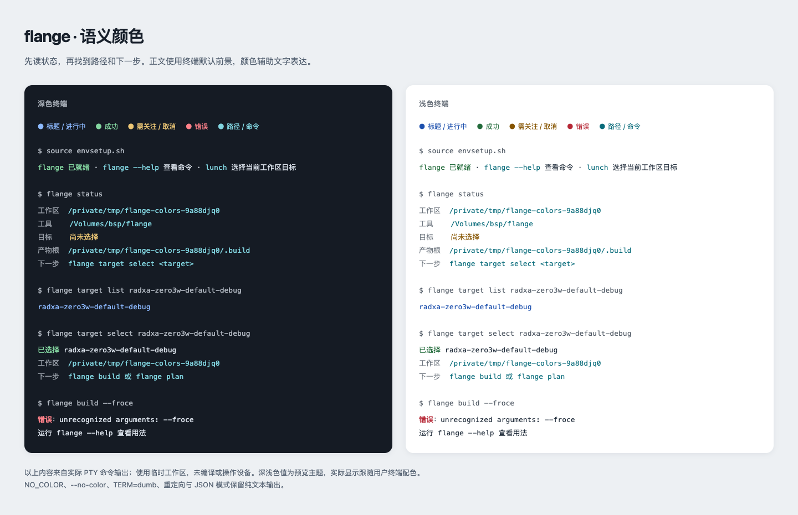

# 命令行与交互体验审查

本次审查覆盖初始化、目标选择、外部 App、构建、部署、验证、调试和故障恢复。
评价依据是开发者完成任务时需要理解的概念、需要记住的命令，以及每一步得到的反馈；
终端视觉服务这些需求。本文随 CLI 变更同步维护；生命周期改造见 `redesign-build-lifecycle`，
语义颜色约定见 `semantic-terminal-colors`。真实构建日志的后续修正记录在 `improve-build-log-experience`。

## 1. 设计原则

一次调用由 **意图、工作区、目标、输入、结果** 组成。这些事实只解释一次，然后传给执行服务。
终端、Shell 和 Docker 不分别维护目标与路径的另一套解释。

- 命令可发现：顶层帮助说明用途，资源命令提供完整动作及参数帮助。
- 默认值可解释：App 参数省略时指向当前调用目录；系统构建默认为 image；目标来自工作区状态。
- 操作可预览：`plan` 展示依赖与输出，不能在预览中下载源码或产生成功记录。
- 状态有证据：成功来自完整产物清单，缓存复用来自本次执行报告；目录存在不等于构建成功。
- 失败可恢复：保留日志和字段位置，给出下一步；取消不能被渲染成成功。
- 自动化可组合：结果、过程和退出状态有明确边界，CI 不被交互提示挂起。

这些原则也参考了 [Command Line Interface Guidelines](https://clig.dev/) 对可发现性、
可组合输出和可操作错误的建议；具体契约以本仓库的实现与 OpenSpec 为准。

本轮终端反馈同时参考 Apple HIG 的[反馈原则](https://developer.apple.com/design/human-interface-guidelines/feedback)：
让人理解当前状态、操作结果以及下一步；[进度指示原则](https://developer.apple.com/design/human-interface-guidelines/progress-indicators)
则区分可确定和未知工作量，并要求进度表达准确。flange 将这些原则适配到终端：
保留清晰的层级、当前动作和实际耗时，未知总工作量时不显示确定百分比。

## 2. 审查发现与实现

| 原有问题 | 对开发者的影响 | 当前实现 |
|---|---|---|
| Shell 承担大量参数解析与 Python 字符串拼接 | 命令行为分散，维护时难以追踪 | `cli.py` 解析、`commands.py` 编排、领域服务执行 |
| 状态依赖仓库根和 Shell 环境变量 | 外部目录或重开终端后目标容易混淆 | `flange.toml` 与工作区 `.flange/current_config` |
| 宿主与容器重新解释路径 | 外部 App 构建前后指向不同目录 | 同绝对路径挂载，显式 WorkspaceContext |
| 构建 App 存在多套动词入口 | 单个、批量和部署构建行为不一致 | 统一 `app <action>`，依赖闭包与报告复用 |
| 状态输出把目录存在当成就绪 | 陈旧或不完整产物容易被误判 | status 展示记录位置；why 核验清单与输入 |
| 无独立机器输出协议 | 自动化要解析中文文本和 ANSI | 带 schema_version 的 JSON 结果；过程写 stderr |
| 非交互环境仍可能等待输入 | CI 卡住，失败不明确 | `--no-interaction`，缺少目标立即给出选择指引 |
| NO_COLOR 关闭颜色但部分 spinner 仍运行 | 无颜色终端中仍有控制符和动画 | 颜色与动画共同按终端能力降级 |
| 各入口分别维护颜色，普通状态缺少统一语义 | 缓存待构建、成功复用与失败不易辨认 | 共用语义角色，按真实结果着色；正常缓存未命中表示待构建 |
| 固定最小宽度大于实际终端 | 窄窗口表格和粘性状态行溢出 | 尊重实际宽度；摘要降级成文本记录 |
| 中文组合字符宽度计算不完整 | 文本对齐和截断出错 | 共用显示宽度函数，组合标记不重复占列 |
| 跳过组件耗时固定为 0.1 秒 | 输出包含人为编造的数据 | 跳过不报告虚构执行耗时 |
| 外层加载报告时把首次构建显示为复用 | 用户无法判断真正执行了什么 | 持久化并保留本次每个 App 的 reused 状态 |
| 等待锁之前打开并轮转日志 | 并发命令干扰正在构建的日志 | 获得目标锁后才创建构建输出 |
| 独立 App 构建直接输出所有编译器信息 | 日常结果难找，日志行为与系统构建不同 | 系统、App、Package 共用 BuildOutput、日志及 `-v/-q` |
| 工具拦截应用自己的 `--help` | 运行意图被改变，应用退出状态丢失 | 只解析 `--` 之前的工具参数 |
| 脚手架默认架构不跟随当前目标 | ARM32 用户创建后还需手工改配置 | 创建 App 自动使用当前工作区用户态架构 |

### 真实长构建暴露的问题

本轮依据用户提供的 `khadas-vim3/default/debug` 实际记录审查。kernel 阶段约耗 47 分钟，
整次请求在约 50 分钟时因 recoveryctl 的运行入口校验失败结束；这份记录证明前面若干阶段执行过，
不能证明完整镜像已经交付。

| 实际记录 | 新人的判断困难 | 本轮处理 |
|---|---|---|
| Git 原文直接接在实时状态行后面 | 看起来像乱码或界面损坏，难以分清动作边界 | 源码和子进程原文统一捕获，NORMAL 只显示当前动作 |
| 内核仍在执行时显示 0%，完成后显示 14% | 容易把组件数量误解为剩余编译时间 | 去掉任务百分比，保留真实阶段与已耗时 |
| 宽横线、右端耗时和资源摘要占据注意力 | 扫描名字、动作和结果需要在整行来回移动 | 有限宽度的文本层级；默认突出 App 名称，不露内部摘要 |
| 无重绘时步骤文案等命令结束才出现 | 长时间没有新状态，用户难以判断是在编译还是卡住 | 动作开始立即显示，结果随后确认 |
| 普通状态通知被当作持续动作计时 | “源码已就绪”可能承接后续编译耗时，信息与实际执行不符 | 状态只说明事实，只有显式步骤边界记录结果与耗时 |
| 同一运行入口错误被错误框、耗时表和两层 CLI 重复展示 | 最后一条 Docker 错误盖过真正需要修改的路径 | 根因与上下文集中一次呈现，外层只传播已有失败状态 |
| 失败后只留下日志，没有最短继续路径 | 用户可能误删缓存并重编已完成的内核 | 指出修复根因后重试原请求，不默认建议 clean/force |

recoveryctl 实际安装在 `/usr/sbin/recoveryctl`。它必须显式声明该运行入口；
默认 `/usr/bin/<name>` 的严格检查继续保留，不能为了让构建通过而移除安装验证。

## 3. 命令信息架构

| 开发阶段 | 入口 | 用户应得到的信息 |
|---|---|---|
| 准备 | `flange doctor`、`flange docker build` | 环境是否就绪、修复命令 |
| 工作区 | `flange init`、`flange status` | 工具位置、工作区、目标和产物归属 |
| 目标 | `flange target list/select/show` | 可用目标、选择结果、有效配置 |
| 开发 | `flange app create/list/plan/build` | 源码位置、依赖、编译结果与准确产物 |
| 系统 | `flange plan/why/build` | 依赖顺序、失效原因、结果与日志 |
| 设备 | `flange app deploy/run/test/debug/log` | 设备身份、运行结果、会话与日志 |
| 维护 | `flange flash`、`flange recovery`、`flange clean` | 明确操作对象、分区或清理范围 |

`lunch` 是 `flange target select` 的简短 Shell 入口，不存另一份状态。
选择成功后的下一步提示为 `flange build 或 flange plan`，用于构建当前目标的完整系统或先预览系统构建计划。
资源组不带动作时显示帮助。外部工具根由工作区清单声明，无需为每个 App 改写 flange 仓库。

## 4. 终端呈现

正常模式突出任务、阶段、缓存决策和结果位置。编译器完整输出写入 build.log，
需要逐行检查时使用 `--verbose`。`--quiet` 收紧过程展示，错误证据仍保留。

公共命令、构建、刷写和目标选择使用同一套语义颜色，保留文字状态与符号：



图中内容来自临时工作区的实际终端记录；示例主题用于展示角色关系，具体色值由用户终端决定。
`--froce` 是故意输入的错误选项，用于展示错误反馈，没有执行构建。

| 颜色 | 表达的含义 | 示例 |
|---|---|---|
| 蓝色 | 标题、正常需构建、进行中 | 构建计划、需构建、正在编译 |
| 绿色 | 成功、可复用 | 检查通过、缓存可复用 |
| 黄色 | 警告、受阻待准备、取消 | 待准备、缺少前置条件、用户取消 |
| 红色 | 错误、失败 | 配置无效、构建失败 |
| 青色 | 路径、命令 | 日志位置、修复命令 |
| 默认前景；次要内容降低亮度 | 正文、辅助说明 | 名称、说明、耗时 |

颜色根据结果字段和明确的语义角色选择。正常缓存未命中表示蓝色“需构建”；缺少判断所需输入表示黄色“待准备”。
路径中即使包含“失败”等字样，也继续按路径呈现。只突出状态、标题和可继续操作的位置，避免整段正文着色。

NORMAL 使用目标、阶段、动作与结果的简洁层级，正文排版不超过约 96 列；
不绘制大横线、错误框、任务百分比或耗时条。阶段序号只是执行顺序，不能估计剩余时间。
交互终端只显示一条当前动作与实际已耗时状态；NORMAL/VERBOSE 在非重绘场景下，动作开始时立刻输出普通文本，
结束时再给出结果，长时间编译不会到结束才首次出现状态。QUIET 保留最终摘要。
即时状态通知不计时；步骤结果与耗时绑定实际执行范围，不能由相邻文案推断。
步骤可以嵌套，计时统一使用 monotonic（单调时钟），不受系统时间调整影响。

最终摘要保留真实阶段结果计数、总耗时和日志位置；阶段完成数量不代表重新编译的 App 数量。
App 自身是否复用由逐项状态与构建报告说明。详细模式可追加组件状态与耗时列表。
失败时集中提供一次原因与相关命令上下文，外层 Docker/CLI 不再次包装同一错误。
默认系统构建的恢复提示使用 `flange build`，组件请求保留对应组件；修复前不默认要求删除缓存。

在管道、`TERM=dumb`、`NO_COLOR`（包括空值）或 `--no-color` 环境中，输出保留文字语义，
普通命令禁用颜色、动画与进度重绘。目标菜单在禁色后保留导航绘制与焦点反显；非 TTY 不进入菜单。
stdout 和 stderr 按本次实际输出流分别判断，重定向后的结果文件保持纯文本。
JSON 使用原始结果数据，JSON 模式的 stderr 过程与持久化日志也不包含颜色控制码。

禁色入口参考 [NO_COLOR 约定](https://no-color.org/)；flange 进一步将空值也视作禁色，
并关闭普通命令的动画。菜单使用 [curses 的默认终端颜色](https://docs.python.org/3/library/curses.html#curses.use_default_colors)，
不设置固定背景。
窄终端使用可折行的结果记录，错误原文与文件路径不会被仅为美观而截掉。

目标选择器支持键盘导航与过滤，后台加载当前目标的配置摘要，不让完整 Jsonnet 求值阻塞每次按键。
无终端时使用显式目标名，避免菜单成为自动化接口。

## 5. 机器接口与恢复

```sh
flange --json status
flange --json --target radxa-zero3w-default-debug plan kernel
flange --no-interaction target select radxa-zero3w-default-debug
flange --json app build ./apps/hello
```

成功结果包含 `schema_version`、`command`、`ok` 和 `data`；参数或操作错误包含 `error.kind`、
`error.message` 和 `error.exit_code`。测试失败也返回结构化会话数据，便于定位日志。
帮助仍作为帮助文本显示。`--` 后的参数属于用户程序，全局解析器不消费它们。

| 退出码 | 语义 |
|---|---|
| 0 | 请求完成 |
| 1 | 环境或执行失败 |
| 2 | 参数或配置无效 |
| 130 | 用户取消 |
| 其他非零值 | App/test 等被执行程序的退出状态；超时为 124 |

完整构建日志按配置轮转；取消和失败不发布新的成功清单。
原始 Git、编译器和包管理器输出都经过同一捕获通道，避免它们自己的回车进度破坏活动行。
NORMAL 的紧凑终端不是精简版日志：需要完整证据时直接查看 build.log，或在修复后重试时指定 -v。
重新运行同一请求时，引擎重新验证输入和产物，不要求用户先手工删除缓存。
`flange clean --dry-run` 列出当前目标的清理范围。

## 6. 验证证据与边界

- 工作区测试验证状态隔离、路径归属、只读发现、严格字段和显式覆盖不持久化。
- CLI 测试验证 JSON 可解析、未知选项不被忽略、无交互选择不读取 stdin 和可操作错误。
- Bash/Zsh 测试通过真实 shell 验证带空格路径、安装失败重试、依赖探测与调用者状态保持。
- 输出测试覆盖日志轮转、阶段信息、窄终端、中文宽度与无颜色能力；本轮另核对长动作开始反馈、单行所有权、原始工具捕获和失败去重。
- Docker 验收在外部临时工作区实际编译 Make/CMake/Meson 的 ARM64 与 ARM32 App，
  检查 ELF、准确产物、缓存命中、权限损坏后重建，以及单个 App 的库依赖闭包。

真实设备部署和 GDB 会话的最终体验仍需对应设备验收；传输测试不能替代实机。
APT 仓库的软件包版本、上游源码供应和设备端服务状态也属于需要单独记录的外部条件。
本轮日志改造的完整测试结果与实际运行范围见[验证记录](../openspec/changes/archive/2026-09-05-improve-build-log-experience/validation.md)。
