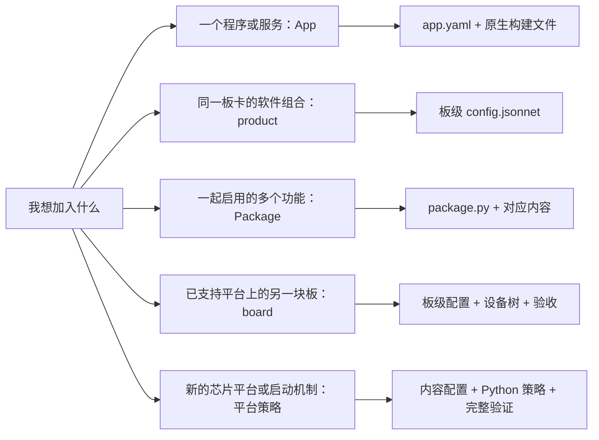
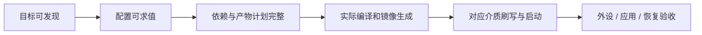

# 扩展指南：选择最小的改动层

适合已经完成[第一次使用](first-steps.md)，准备加入自己的软件、产品或硬件的开发者。
下文的 App 示例在外部工作区执行；产品和板卡示例在你维护的 flange 工具 checkout 中修改。
暂时不会修改 Python 也能完成前两种扩展。

## 1. 我应该从哪里扩展



| 扩展 | 典型需求 | 首先要会什么 |
| --- | --- | --- |
| App | hello 程序、业务服务、应用库 | 基本源码与 CMake/Make 等构建方式 |
| product（产品配置） | 同一块板用于桌面、演示或另一种业务 | 目标命名和 Jsonnet 基础 |
| Package（功能包） | 将应用、外部驱动和设备树一起启用 | 各组件职责及板级启用条件 |
| board（板卡） | 已支持 SoC 上的新载板 | 原理图、设备树、启动与存储布局 |
| platform（平台） | 新供应商启动链或镜像机制 | BSP、引导、内核、镜像和刷写协议 |

工作区清单目前声明工具根、App 来源、目标和输出根，不提供任意外部板卡目录的插件发现。
外部 App 可以独立维护；新增系统产品、板卡和平台内容在工具 checkout 的 `components/` 中维护。

## 2. 给现有板卡增加一个产品

目标：为已有的 `radxa-zero3w` 增加 `demo` 产品，把系统 hostname（主机名）设为 `flange-demo`。
这一练习只需配置求值即可判断第一步是否成功，暂不构建镜像或连接开发板。

### 找到配置

在工具 checkout 的工作分支修改
[`components/board/radxa-zero3w/config.jsonnet`](../components/board/radxa-zero3w/config.jsonnet)。
下面展示该示例的完整板级配置；实际项目修改时保留你的其他板级设置：

```jsonnet
// Radxa ZERO 3W 示例：为已有板卡增加 demo 软件产品。
local product = std.extVar('product');

{
  board: 'radxa-zero3w',
  soc: 'rk3566',
  platform: 'rockchip',
  products: ['default', 'desktop', 'demo'],
  variants: ['debug', 'release'],
  packages: ['rockchip-multimedia'] +
            (if product == 'desktop' then ['ubuntu-desktop'] else []),
  kernel+: { device_tree+: { name: 'rk3566-radxa-zero-3w' } },
  rootfs+: {
    hostname: if product == 'demo' then 'flange-demo' else 'radxa-zero3w',
  },
}
```

这里仅需理解三件事：`products` 声明可选名字；`std.extVar('product')` 读取本次所选产品；
`rootfs+:` 在继承的 rootfs 对象上追加字段，保留原有用户、软件包等设置。
`rootfs:` 直接替换对象的语义不同，修改前读[配置分层说明](build-system-design.md#41-系统配置求值)。

### 查看结果

在同一个工具 checkout 中执行：

```bash
flange target list radxa-zero3w-demo
flange --target radxa-zero3w-demo-debug target show
flange --target radxa-zero3w-demo-debug plan rootfs
```

成功时，列表包含 `radxa-zero3w-demo-debug` 和 `radxa-zero3w-demo-release`；
配置摘要的 hostname 为 `flange-demo`，计划列出 rootfs 的前置依赖。
`--target` 只覆盖本次命令，没有改变工作区保存的目标，也还没有生成新镜像。

### 追踪到实际代码并验证

这个字段由 [`config/schema.py`](../builder/config/schema.py) 检查类型，
[`RootfsBuilder._install_hostname`](../builder/rootfs.py) 写入目标系统的 `/etc/hostname` 与 `/etc/hosts`。
它不是终端里显示的标签，而是实际系统配置。

为新 product 增加配置回归断言，确认 hostname 及其他产品保持预期。
目标数量变化时，同步 [`test_canonical_matrix.py`](../tests/config/test_canonical_matrix.py) 的目标清单期望，
保留对已有目标的验证。准备好镜像环境和真实板卡后，继续显式使用同一目标：

```bash
flange --target radxa-zero3w-demo-debug build image
flange --target radxa-zero3w-demo-debug flash --list
```

按[刷写流程](development-guide.md#4-刷写与设备验证)操作时也保持这个目标，
或先执行 `flange target select radxa-zero3w-demo-debug` 保存它。设备启动后运行 `hostname` 完成最终验证。

## 3. 加入自己的 App

先在已初始化、已选目标的**外部工作区根目录**执行：

```bash
flange app create sensor-agent --dir apps --type exec --build-system cmake
flange app plan ./apps/sensor-agent
```

会得到以下可独立维护的源码树：

```text
apps/sensor-agent/
├── app.yaml          # 名称、架构、构建方式、安装与运行契约
├── CMakeLists.txt    # 交给 CMake 的编译/安装规则
└── src/main.c        # 你的业务代码
```

仍在工作区根目录，在 `apps/sensor-agent/src/main.c` 修改程序，准备好 Docker 镜像后执行：

```bash
flange app build ./apps/sensor-agent
```

成功时得到编译报告、准确的 deb 包路径和完整日志；目标程序在 Docker 中交叉编译。
**交叉编译**是“在电脑上生成开发板架构的程序”，因此不要把生成的 ARM 程序当作宿主程序直接运行。
部署及调试接着使用[设备流程](development-guide.md#6-部署运行与源码调试)。

修改 App 类型时，`service` 表示 systemd 后台服务，`lib` 表示供其他 App 使用的库，
`test` 表示验证程序。完整类型组合、依赖和安装字段见 [App 参考](app-architecture.md)。
系统构建不会因为在工作区发现了 App 就自动把它装进镜像；产品需在 `rootfs.custom_packages` 选择该 App。
若要把本节的应用加入系统，在目标板的 `config.jsonnet` 中合并以下片段，保留原来的 rootfs 字段：

```jsonnet
// 合并到板级配置的同一个 rootfs+ 对象中；这是片段，不是完整文件。
rootfs+: {
  custom_packages+: ['sensor-agent'],
},
```

`custom_packages+:` 追加应用，保留原有系统 App。仍从含 `apps/sensor-agent` 的外部工作区运行
`flange app plan ./apps/sensor-agent` 与 `flange plan rootfs`，使用与配置对应的当前目标；
该工作区的 `flange.toml.tool_root` 必须指向你刚修改的工具 checkout。
`app_dirs = ["apps"]` 负责发现来源，`rootfs.custom_packages` 负责选择安装，两者缺一不可。
需要把来源与选择一起交付给其他产品时，可按下一节组合成 Package。

## 4. 把 App 组合成可启用的 Package

**先验证独立包。** 在外部工作区根目录运行：

```bash
flange package create demo-feature --dir packages --type exec --build-system cmake
flange package plan ./packages/demo-feature
```

脚手架创建一个 Package，其中的 `vendor` component 指向内嵌 App：

```text
packages/demo-feature/
├── package.py
└── app/
    ├── app.yaml
    ├── CMakeLists.txt
    └── src/main.c
```

`package.py` 的主要结构如下：

```python
"""演示功能包：把一个用户态应用加入系统。"""

PACKAGE = {
    "name": "demo-feature",
    "description": "演示应用功能包",
    "components": [
        {"type": "vendor", "name": "demo-feature", "dir": "app"},
    ],
}
```

`dir` 相对包目录，`name` 与 App 描述保持一致；`package.py` 是会执行的 Python 文件，
只加载你信任的来源。准备好 Docker 后用 `flange package build ./packages/demo-feature` 验证独立构建。

**再加入产品镜像。** 把已验证的整个包纳入你维护的工具 checkout 的 `components/packages/demo-feature/`，
在目标板的 Jsonnet 配置中把 `'demo-feature'` 加入顶层 `packages` 列表，保留原有包。
重新 `target show`、`plan rootfs` 确认，再构建 rootfs。此时 Package 的 vendor App 才加入系统安装集合。
外部 `packages/` 目录用于独立开发，不会自动注册为系统配置中的功能包。

| component 类型 | 负责什么 | 从哪里验证 |
| --- | --- | --- |
| `vendor` | 用户态 App，打 deb 并加入 rootfs | `package plan/build`，再验证系统安装 |
| `oot-driver` | 内核树外的驱动模块 | 系统 `plan/build kernel` 与真实驱动测试 |
| `devicetree` | 板卡设备树覆盖文件 | 系统 overlay/boot 计划和目标硬件验证 |

多个类型可组合成一个包，但不能把内核模块当作普通用户态 App 编译。
内核模块 `.ko` 描述可加载驱动；设备树描述设备和连线。两者配合也不自动证明接线正确。
已有组合包可参考 [`meizu-e3-panel`](../components/packages/meizu-e3-panel/package.py)，
额外动作与多组件选择见[Package 使用参考](development-guide.md#7-package-与自定义生命周期)。

## 5. 新板卡和新平台

先确定新硬件能否复用现有平台和 SoC，再选择工作范围：

| 层级 | 至少需要提供 | 第一阶段检查 | 最终检查 |
| --- | --- | --- | --- |
| board | `components/board/<board>/config.jsonnet`、设备树、存储/产品策略 | 名称被发现，配置通过校验，plan 有完整依赖和产物 | 对应介质启动、驱动与外设 |
| SoC | `components/platform/<platform>/<soc>/config.jsonnet`、源码与工具链事实 | 引用可解析，架构/分区合法，已有平台策略可消费 | 完整启动链和目标功能 |
| platform | 平台/SoC/board 内容及 `builder/platforms/<platform>/` 策略 | 平台契约、产物计划、镜像/刷写路由测试 | 实际编译、刷写、启动与恢复 |

板卡身份必须与目录名一致，产品和变体明确列出。不要只复制另一块板的名字而保留它的设备树、
内存地址或分区布局；这些值必须来自你的硬件、BSP（板级支持包）和验证记录。

平台包契约从 [`PlatformSpec`](../builder/platforms/spec.py) 开始阅读，
它要求 `ARTIFACT_NAMES` 与 `create_builder`；完整适配还涉及
[`component_plan.py`](../builder/component_plan.py) 的输出契约、分区和宿主刷写策略。
“目标出现在菜单里”仅证明它可以被发现，距离可用板卡还需要后续验证。



每一步记录具体 target 和证据。板卡文档要写清所需硬件、接线来源、进入刷写模式的方法、
成功时看到什么，以及尚未验证的介质和外设。电气参数和按键操作以对应板卡的官方资料为依据。

## 6. 让别人能够继续维护你的扩展

提交 App 时提供可运行示例和安装/运行说明；提交产品时解释每个差异的理由；
提交板卡或平台时提供来源和分层验收记录。把字段、源码、测试和文档放在同一个变更中。
下一步读[维护指南](maintenance-guide.md#5-选择合适的验证)和[贡献流程](../CONTRIBUTING.md)，
然后按 ProjectSpec 与 OpenSpec 完成检查和归档。
