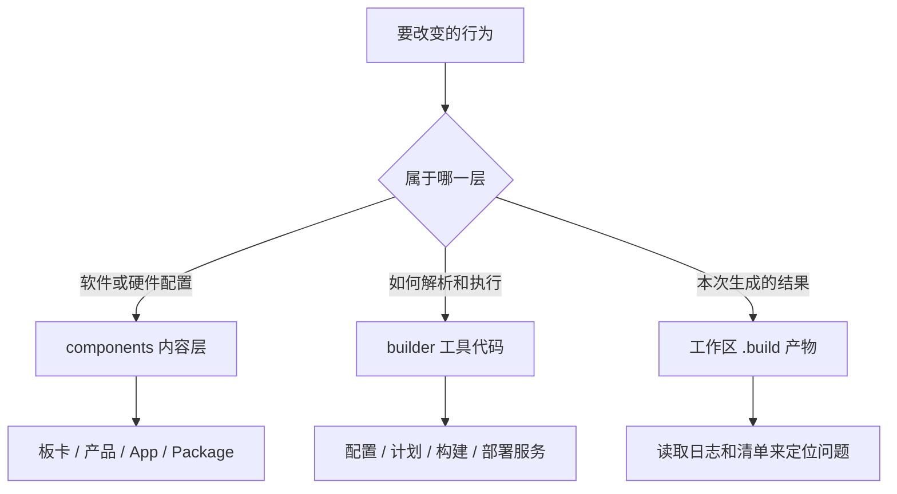
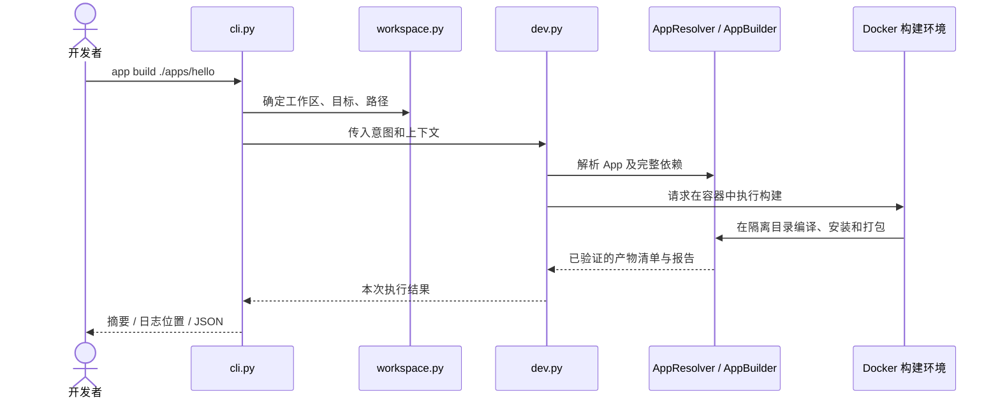

# 维护指南：从一个问题找到要改的代码

适合已经完成[第一次使用](first-steps.md)、准备修复问题或参与贡献的读者。
只想使用工具时查[开发指南](development-guide.md)；要增加 App、产品或硬件支持时读[扩展指南](extension-guide.md)。

读完这一页，你应该能回答三个问题：**这件事由哪个模块负责、改完怎样证明有效、哪些文档也要更新。**

## 1. 先分清你在维护什么



`components/` 描述“构建什么”；`builder/` 实现“怎样构建”。`.build/` 是输出和缓存，
其中的修改通常会在下次构建消失。修复应落回配置或源码，而不是只修生成文件。
外部 App 则维护在自己的工作区，通常无需改 flange 的工具代码。

| 你要改变什么 | 先看这里 | 需要理解的边界 |
| --- | --- | --- |
| App 源码、安装路径或服务行为 | 自己的 `app.yaml`、源码和原生构建文件 | [App 契约](app-architecture.md) |
| 某块板的软件包、产品或设备树选择 | `components/board/<board>/config.jsonnet` | [配置教程](extension-guide.md#2-给现有板卡增加一个产品) |
| 同一芯片或平台共有的硬件事实 | `components/platform/<platform>/<soc>/`、平台配置 | [配置分层](build-system-design.md#41-系统配置求值) |
| 命令参数或错误提示 | `builder/cli.py`、`commands.py`、`presentation.py` | 参数解析、服务编排和呈现各自独立 |
| 字段被接受、拒绝或展开的方式 | `builder/config/schema.py`、`validate.py`、`jsonnet.py` | 字段必须有类型规则和实际消费者 |
| 为什么重建、为什么错误复用 | `graph.py`、`component_plan.py`、`cache.py`、`artifacts.py` | 输入和实际产物共同决定有效性 |
| 容器路径或外部源码找不到 | `workspace.py`、`docker.py`、`oot_mounts.py` | 工具、工作区、产物根分开传递 |
| 某个平台编译/镜像配方 | `builder/platforms/<platform>/` | 平台策略使用通用组件生命周期 |
| 部署、测试或 GDB 调试 | `builder/dev.py`、`deploy.py` | 设备会话消费准确的 App 构建报告 |

表中未写目录前缀的 Python 文件均在 `builder/` 下。[完整模块地图](build-system-design.md#3-模块职责与抽象)
可继续展开，但不需要为了修改一条命令先阅读所有平台。

## 2. 跟着一条命令读代码

以 `flange app build ./apps/hello` 为例，按箭头阅读：



这里的 **context（上下文）** 是“这次操作属于哪个项目和目标”的值；
**manifest（产物清单）** 是“成功结果包含哪些文件及其身份”的记录。
报告回答本次构建完成了什么，日志回答执行过程中发生了什么。它们用途不同。

系统命令 `flange build kernel` 从 `commands.py` 进入 `engine.py`，通过组件计划调用平台策略。
对照这两条路径，可以理解为什么 CLI 不应另写一套 App 缓存、路径解析或平台构建规则。

## 3. 复现一次问题

先在**发生问题的工作区**运行：

```bash
flange status
flange target show
flange doctor
```

这三条分别确认项目/产物归属、有效目标配置、工具环境。随后选与问题对应的检查：

| 现象 | 下一步 | 你要判断什么 |
| --- | --- | --- |
| 目标不在列表 | `flange target list` | board 的 products/variants 是否声明了它 |
| 系统组件被重建 | `flange why kernel` | 哪个具名输入或产物发生变化 |
| 不清楚将执行什么 | `flange plan image` 或 `flange app plan ./apps/hello` | 依赖闭包和预期输出 |
| 编译失败 | 查看命令报告的 `build.log`，必要时重跑并加 `-v` | 第一处编译错误及其上下文 |
| 设备行为异常 | 查看本次会话报告及设备启动日志 | 是产物、传输、启动还是应用本身的问题 |

准备一个最小复现：完整 target、最少源码/配置、具体命令、预期和实际结果。
`status` 只报告记录位置；目录存在并不能证明结果有效。
不要一开始就清空所有缓存：日志与 `why` 的理由往往正是定位问题需要的证据。

并行工作区若在 `apt-get update` 遇到缓存锁冲突，先检查是否还有旧版本构建或手工 APT 命令。
当前工具通过 `AptCache` 对同一实际缓存串行执行 APT 事务；锁位于目录旁的
`.<目录名>.flange.lock`，各工作区的目标锁不能替代它。更新工具后，已经运行的旧进程仍使用旧规则，
需等待它结束后重跑验收。不要删除 `/var/lib/apt/lists/lock` 或终止不属于当前任务的构建。

## 4. 把修复做成一个可审阅的变更

在**工具 checkout** 中先查看 `git status`，区分自己的修改与已有工作，按
[ProjectSpec 的分支与提交规则](../ProjectSpec.md#10-git-规范)组织改动。
若只修改外部 App，则在该 App 所属仓库维护和提交。

一个适合第一次贡献的例子是“未知参数的错误提示没有给出帮助命令”：

1. 用错误参数复现，记录退出码和终端输出。
2. 从 `cli.py` 找到参数解析，确认提示由 `presentation.py` 的解析器提供。
3. 在负责提示的地方修改，保留参数错误退出码与 JSON 结果契约。
4. 用 CLI 测试验证人类输出、JSON 和无交互场景；不需要启动板卡。
5. 如果改变了公共行为，同步交互说明及对应规格。

**新增配置字段**需要更完整的链条：


只让 schema 接受新名字还不算实现。必须能追踪到消费者，并证明输入变化后正确重建。
配置解析器自动生成的字段不要让用户在配置里手工填写。

## 5. 选择合适的验证

以下命令在工具 checkout、已执行 `source envsetup.sh` 的环境中运行：

```bash
# 修改期间先跑与你改动相关的用例，例如 CLI
python -m pytest tests/builder/test_workspace_cli.py

# 收尾时运行仓库要求的完整检查
python -m pytest
npx --yes @fission-ai/openspec@1.2.0 validate --all --strict
git diff --check
```

`npx` 需要 Node.js/npm；仓库 CI 使用 Node 22。OpenSpec 的 npm 包名是 `@fission-ai/openspec`。
查看[贡献说明](../CONTRIBUTING.md)了解问题报告与提交要求。

| 证据 | 能说明什么 | 不能单独说明什么 |
| --- | --- | --- |
| 配置/单元测试 | 解析、计划和失败分支符合契约 | 编译器实际生成了正确目标程序 |
| Docker 集成编译 | 原生构建工具实际产出对应架构结果 | 你的板卡一定能启动或外设正常 |
| 真机记录 | 指定板卡、介质和版本的实际行为 | 所有产品与变体都已验证 |

改变 App 构建适配器时，可在镜像准备好后运行真实编译矩阵：

```bash
flange docker build
FLANGE_RUN_DOCKER_TESTS=1 python -m pytest tests/integration/test_oot_lifecycle.py
```

默认测试中的 `skipped` 表示没有执行这一层验证，不能写成编译通过。
涉及板级行为时记录板卡版本、介质、target、源码版本、连接方式及观察结果。

## 6. 同步文档并提交

| 发生了什么变化 | 更新哪里 |
| --- | --- |
| 首次使用的命令或前提改变 | README、[入门指南](first-steps.md)、[开发指南](development-guide.md) |
| 字段、命令或产物契约改变 | 对应参考页、ProjectSpec、`openspec/specs/` |
| 模块职责改变 | [架构地图](build-system-design.md)、相关 Wiki 子系统页 |
| 新板卡或硬件限制 | 板卡页、平台索引、使用前提和实机记录 |

OpenSpec 的一次变更包含 `proposal.md`（问题和范围）、`design.md`（做法与取舍）、
`specs/`（能力变化）和 `tasks.md`（实施清单）。完整流程见[贡献说明](../CONTRIBUTING.md#提交一个改进)。
当前规格用于回答“现在应当怎样工作”，归档与历史设计用于解释“为什么作过这个决定”。

提交前确认：读者能从文档找到新行为、示例使用当前字段、链接可点击，验证记录明确区分软件检查与实机结果。
每个改动保持单一目的，提交描述写清问题、最终行为和证据。
