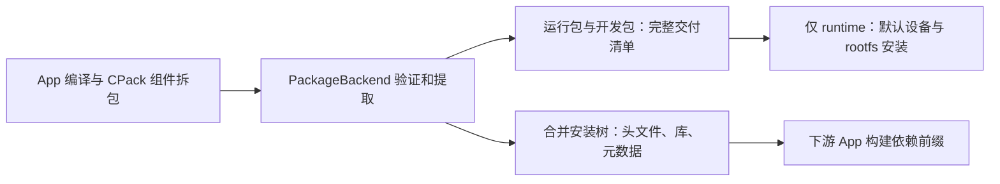

# 包格式后端与 CPack 接入

`flange app build` 可以交付多个独立的软件包。每个包都有精确文件名和明确角色，
构建、依赖消费和部署共同读取这份交付记录。当前实现 DEB（Debian 软件包）；
它与 `flange package` 的 Package（功能包）概念不同。

## 1. 选择由谁打包

| 工程情况 | 配置 | Flange 的工作 |
| --- | --- | --- |
| 常规 App，交付规则较简单 | 省略 packaging.outputs | 从 install 树打包；lib 默认拆为运行包和开发包 |
| 工程已有 CPack 或自己的打包脚本 | packaging.outputs 精确列出完整包 | 验证包、提取安装树、发布原包与报告 |
| 只为其他 App 提供构建输入 | app.type=staging | 发布安装树，不交付软件包 |

`runtime` 表示默认需要安装到运行设备的包；`development` 表示交付给开发者、供下游编译消费的包。
角色由配置声明，不能从文件名或包架构猜测。



## 2. CPack 工程的 app.yaml

下面展示一个服务与开发 SDK 分开交付的配置。文件名必须与实际 CPack 输出一致；
例子的构建脚本、unit、源代码与维护脚本由工程提供。

```yaml
app:
  name: telemetry
  version: 1.0.0
  description: 遥测服务与客户端 SDK
  type: service
  arch: [aarch64]
maintainer:
  name: flange
  email: flange@localhost
build:
  system: custom
  commands:
    - [python3, tools/flange_build.py]
systemd:
  unit: telemetry.service
  auto_start: false
packaging:
  format: deb
  outputs:
    - file: telemetry_1.0.0_arm64.deb
      role: runtime
    - file: telemetry-dev_1.0.0_arm64.deb
      role: development
```

`systemd.unit` 使用 `.service` 文件名或源内相对路径，其 basename 绑定 `app run/log/debug`。
启动命令写在真实 unit 的 `ExecStart=`，没有 `service.name` 或 `service.command` 字段。
完整包的首次启用、升级、配置保留与用户数据保护由 CPack 维护脚本负责，Flange 不重写这些脚本。
`auto_start: false` 不会撤销外部包自身的启用动作；应让维护脚本兑现同一策略。

完整外部包不接受另一份 `install/depends/conffiles/data_dirs/maintainer_scripts/lib` 声明或
`auto_start: true`，避免设置被静默忽略。编译依赖仍可通过 `build.deps`、`build.apt_packages` 声明。

CPack 使用 `CPACK_DEB_COMPONENT_INSTALL=ON` 开启组件拆包，组件专属变量使用大写组件名。
精确输出名和架构分别由 `CPACK_DEBIAN_<COMPONENT>_FILE_NAME` 与
`CPACK_DEBIAN_<COMPONENT>_PACKAGE_ARCHITECTURE` 控制，见
[CPack 官方 DEB 文档](https://cmake.org/cmake/help/latest/cpack_gen/deb.html)。
纯头文件/接口型开发包可以是 `all`，包含目标静态库或共享库时应使用实际架构。
Flange 逐包检查 `Architecture`，接受当前目标架构或 `all`，并检查提取后的用户态 ELF。

## 3. 构建脚本与输出路径

custom 的 commands 是 argv 数组，不做 Shell 或环境变量字符串展开。
脚本通过环境读取 `FLANGE_APP_WORK_DIR`、`FLANGE_APP_OUTPUT_DIR`、`CC/CXX` 等值：

```python
import os
from pathlib import Path
import subprocess

build = Path(os.environ["FLANGE_APP_WORK_DIR"]) / "cpack-build"
output = Path(os.environ["FLANGE_APP_OUTPUT_DIR"])
subprocess.run([
    "cmake", "-S", ".", "-B", str(build),
    "-DCMAKE_SYSTEM_NAME=Linux",
    "-DCMAKE_C_COMPILER=" + os.environ["CC"],
    "-DCMAKE_CXX_COMPILER=" + os.environ["CXX"],
    "-DCMAKE_INSTALL_PREFIX=/usr",
], check=True)
subprocess.run(["cmake", "--build", str(build)], check=True)
subprocess.run([
    "cpack", "--config", str(build / "CPackConfig.cmake"), "-B", str(output),
], check=True)
```

不要自行 `dpkg-deb --extract` 到 DESTDIR。后端逐包提取后合并安装树，保留链接对象与普通文件权限；
同一路径的不同内容或节点类型会失败。包文件本身保持原样，安装维护脚本不会在导入时执行。
Flange 只把准确声明的包写进产物清单，不扫描目录推断哪些包应交付。

```bash
flange app plan /path/to/telemetry
flange app build /path/to/telemetry
flange --json app build /path/to/telemetry
```

终端显示“运行包”和“开发包”及各自路径；JSON 的 `data.apps[].packages` 给出
`{path, format, role}`。请求报告 `apps/reports/<摘要>.json` 使用 schema_version 3；
旧报告需重新构建。所有包和安装树都进入内容校验，开发包被删除或篡改也不能复用缓存。
`runtime_debs` 读取视图暂时保留，新增消费者应使用通用的包记录。

## 4. 依赖与安装边界

下游 App 声明 `build.deps: [../telemetry]` 后，Flange 先构建服务的完整交付物，
再将运行包和开发包中的安装内容共同组成下游编译前缀。CMake 的配置包、头文件和库可由其原生发现机制消费。
这份前缀不是完整系统 sysroot（目标根目录），系统编译依赖仍由 Ubuntu 构建容器提供。

默认 `app deploy` 和产品 rootfs 只安装 runtime 闭包；开发包可作为 SDK 交付物分发，
Flange 当前没有自动在宿主安装开发包的命令。Ubuntu rootfs 明确只接收 DEB；
默认设备部署要求同一闭包使用单一格式，并由该后端查询设备架构和生成安装命令。

## 5. 维护与扩展后端

| 模块 | 职责 |
| --- | --- |
| builder/packaging/model.py | PackageOutput、PackagingConfig、PackageArtifact |
| builder/packaging/base.py | PackageBackend 抽象接口 |
| builder/packaging/deb.py | DEB 规划、默认拆包、导入、设备命令 |
| builder/packaging/__init__.py | 显式格式注册 |
| builder/build_dependencies.py | Ubuntu 构建容器的 APT 编译依赖 |
| builder/apt.py | 共享 APT 目录、参数与资源互斥，涵盖多个工作区 |
| builder/app_build.py、app_model.py | 通用编排、准确报告、缓存与原子发布 |

增加格式时实现 `validate_output/plan/build/import_outputs/architecture/architecture_command/install_command/recipe_paths`，
并注册到 `get_backend`。通用构建层不需要增加该格式的命令或后缀分支。
格式后端及额外 recipe_paths 都参与输入身份；同时应提供目标运行环境的安装支持，不能直接假定 Ubuntu 能安装任意格式。

验证命令：

```bash
.venv/bin/python -m pytest tests/builder/test_package_backend.py -q
FLANGE_RUN_DOCKER_TESTS=1 .venv/bin/python -m pytest tests/integration/test_cpack_packages.py -q
```

第二项真实生成两个 CPack DEB，由 Flange 提取后让下游 CMake 工程找到 SDK 并链接 ARM64 静态库，
还覆盖缓存复用和开发包丢失后的重建；不连接或部署设备。

报告另外记录 `userland_identity`（发行版和用户态 ABI）；旧报告缺少身份必须重新构建。
rootfs 安装与 `--no-build` 均校验身份。外部包格式、发行版与 SDK 见[多层工作区](layers.md)。
