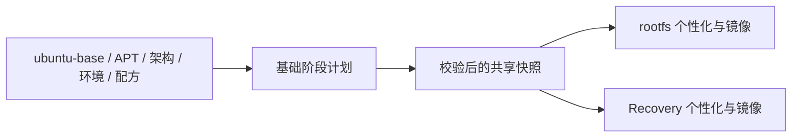

# rootfs 两阶段缓存

rootfs（根文件系统）先准备 ubuntu-base 与 APT 软件包，再叠加当前产品的 App、驱动、固件和设置。
修改 overlay（文件覆盖层）等第二阶段输入时，可复用仍有效的基础快照。

基础阶段由 [`builder/rootfs_base.py`](../../builder/rootfs_base.py) 的 `base_plan()` 统一声明输入：
ubuntu-base URL/SHA256、包列表、APT 推荐依赖策略、额外软件源、用户空间架构、模拟器、实际环境和构建配方。
rootfs 与 Recovery 只有在这些输入都一致时才能共享快照；“包列表相同”本身不够。

快照保存在 `<build_root>/cache/rootfs-base/`，由
[`builder/snapshot.py`](../../builder/snapshot.py) 管理锁、临时文件、完整性校验与原子替换。
损坏或未完成快照不能命中，失败不得覆盖有效成功记录。
归档文件可以保存在宿主共享构建目录，解包和恢复的活树始终在容器原生 `/var/tmp`。
存储配方 `rootfs_storage.py` 纳入 Phase 1 指纹，存储语义变化会使旧配方快照失效；随机临时目录名不改变缓存身份。
归档同时显式保留数字 UID/GID、模式位、链接、扩展属性、文件 capability 与 POSIX ACL；
ubuntu-base 原始解包复用同一组 tar 元数据选项。`snapshot.py` 同样进入 Phase 1 指纹，
归档语义更新会触发旧快照失效，避免缓存恢复后悄悄丢失目标权限。

第二阶段分别消费本次 AppBuildReport（应用构建报告）选出的 deb 集合、内核 modules、固件、overlay 和账户配置，
然后生成对应 ext4/UBI 镜像。目录中遗留的 deb 不会自动变成安装输入。

旧 `BuildCache.compute_phase_hash / is_phase_up_to_date / store_phase` API 已由上述基础阶段计划与快照管理替代。
排障使用 `flange why rootfs`，完整边界见[构建系统设计](../../docs/build-system-design.md)。
