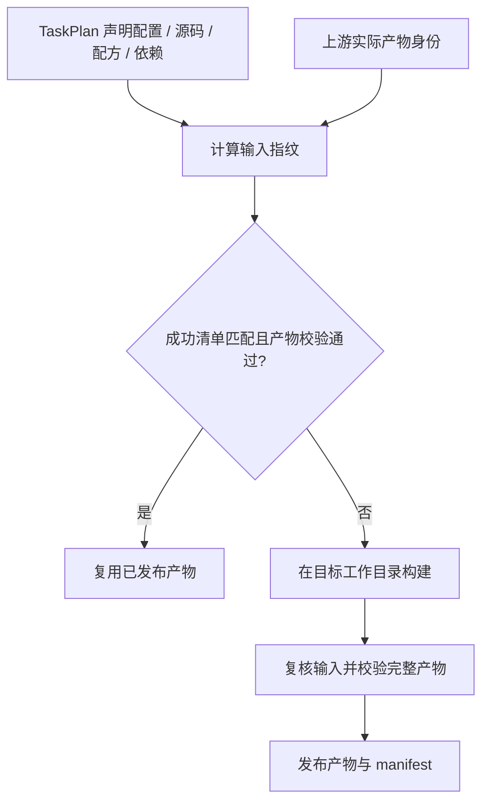

# 内容哈希与增量构建

缓存命中需要同时证明两件事：本次计划输入匹配上次成功记录，而且必需产物仍完整有效。
文件“还在目录里”不足以说明可以复用。



- `TaskPlan` 与 `InputSpec` 声明实际输入，`ArtifactSpec` 声明输出；构建、缓存和解释共用这些声明。
- 下游指纹使用上游 `ArtifactManifest.identity`。上游输入变化而输出内容相同，不必传播无关重建。
- 文件树摘要包含内容、节点类型、权限和符号链接目标；本地源码变更也参与正常缓存判定。
- 旧 `.build_hash` 和仅检查文件存在的成功标记不再有效。产物损坏、缺失或权限变化会使缓存失效。
- [rootfs 基础快照](rootfs-两阶段缓存.md)复用安装发行版包后的基础树，之后再做目标个性化。

```bash
flange plan image
flange why kernel
flange build kernel --force
```

`plan` 与 `why` 是只读预览，不下载或同步远端源码。尚未准备的输入会显示阻塞或无法确定；
实际 `build` 会先准备输入，再判断能否复用。需要逐项排查时读
[维护指南](../../docs/maintenance-guide.md)，接口说明见[缓存系统](../subsystems/缓存系统.md)。

Docker 和内容哈希不单独保证跨时间逐字节复现；移动分支、APT 仓库及工具环境仍需明确固定。
