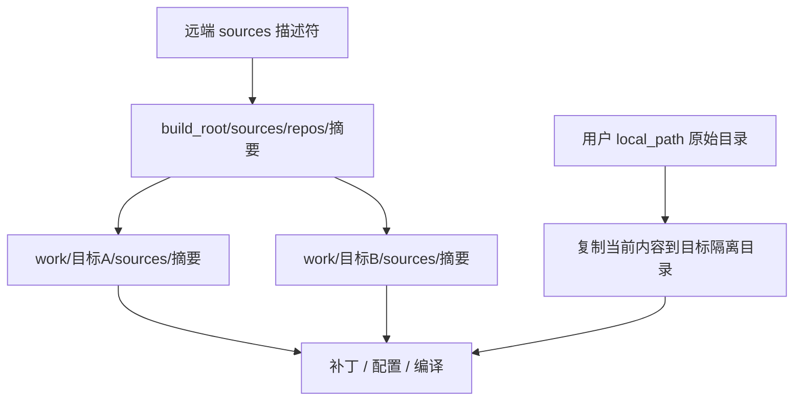

# 源码管理 SourceManager

SourceManager（源码管理器）分离共享下载存储与可变构建工作树。
组件通过 `source: {name, subpath}` 引用顶层 `sources.<name>`，不能在组件下另写旧 `source.url` 配置。

共享仓库按来源描述符标识，并用锁覆盖 fetch（获取远端更新）和目标工作树创建。
Git 输入在目标独立 worktree（工作树）中配置与编译；本地源码复制到目标目录，
内容变化后重新准备副本，原始目录不会被 reset、patch 或 make 改写。

实际构建先调用 `prepare_cache_inputs()` 准备本次需要的来源，再计算计划输入。
`source_path()` 等只读定位用于已有输入；`plan`/`why` 不为了给出预览而下载源码。
内核准备阶段还检查大小写敏感文件系统，环境不满足时失败而不是修改目标驱动配置。

`ensure()` 处理组件引用；`ensure_oot_source()`、`ensure_extra_firmware()` 等复用统一来源解析。
ubuntu-base、额外 deb 与固件下载走带 SHA256 的 descriptor（描述符），
临时下载校验通过后才原子发布。`subpath` 不能越出已声明源码根。

源码覆盖与缓存排障见[维护指南](../../docs/maintenance-guide.md)；
App 名称、路径与依赖解析另见[外部 App 装载](../workflows/external_apps-装载.md)。
