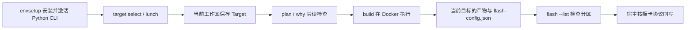

# 从选择目标到构建与刷写

阅读前提：[初学指南](../../docs/first-steps.md)中的宿主准备，以及对应[板卡页](../boards/index.md)的硬件范围。
完整命令说明由[开发指南](../../docs/development-guide.md)维护，本页只串起各阶段。



```bash
# 在完整工具 checkout 中准备环境
source envsetup.sh
flange doctor
flange docker build
flange target select radxa-zero3w-default-debug
flange plan image
flange build image
flange status
flange flash --list
```

`envsetup.sh` 激活 Python 环境并提供 `lunch` 包装；`flange` 是安装后的 Python 命令，
不再是业务 Shell 函数，也不会创建根目录 `target` 链接。
目标保存到当前工作区 `.flange/current_config`，每次命令重新解析配置。

`flange build` 默认构建 `image`；组件列表见 `flange build --help`。
内核组件输出 Image/DTB/modules，需要启动分区镜像时还要构建 `boot`。
构建参数是组件名，`flange flash <名称>` 接受当前清单的分区名；普通 GPT 的 `boot`
不能普遍写成 `kernel`。全量刷写会重写分区布局与镜像，执行前应完成清单、板型和介质匹配。

源码、缓存和发布结果都由当前工作区定位。外部工程必须先 `flange init`，
不能只在工具仓库 `lunch` 后切到任意未初始化目录。

Qualcomm 的 SPI 启动固件与 UFS 系统盘是独立路径：普通 `flange flash` 写 UFS，
`--spi-firmware` 写 SPI。全新 UFS 初始化会清除数据，具体 profile 与重新进入 EDL 的步骤见
[Q6A](../boards/radxa-dragon-q6a.md)和[Q8B](../boards/radxa-dragon-q8b.md)，不要套用到其他平台。
